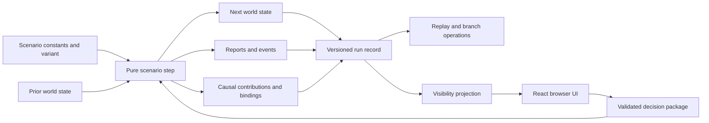

# Architecture

Control Room 0.1.0 is a local-first vertical slice with one scenario. Its architecture is deliberately narrower than the eventual multi-scenario platform: the runtime contracts are reusable, but The Narrows is still implemented directly in TypeScript.

## Dependency boundary

The numerical model is the authority over world state.



The simulation layer has no React import and does not read the DOM, network, filesystem, current wall clock, or ambient randomness. The UI may propose a decision; only the engine validates and applies it.

## Core data contracts

The main types live in `src/lib/sim/types.ts`.

- `WorldState` contains true physical, financial, institutional, project, observation, event, objective, and metric state.
- `DecisionPackage` contains every decision for one weekly step plus forecasts and notes.
- `ValidationResult` separates blocking errors from non-blocking warnings and includes a direct resource preview.
- `StepResult` returns next state together with newly generated events, reports, action changes, objective measures, causal contributions, binding constraints, and invariant checks.
- `SimulationRun` pins versions and seed and contains an initial state, current state, branch metadata, and ordered `TurnRecord` history.
- `VisibleSnapshot` is the player-facing projection. It exposes reported regional state rather than unrestricted access to every truth field.

The engine treats missing forecasts as non-blocking warnings so headless policies and future scenario packages can use the kernel. The shipped player interface deliberately requires all forecasts and a rationale before enabling commit; that stricter rule is a tutorial-workflow constraint, not a different simulation transition.

Financial quantities that need exact reconciliation are stored as integer USD cents. Physical quantities are represented in kilotonnes and rounded at declared model boundaries.

## Pure step

Conceptually, one turn is:

```ts
step(
  state: WorldState,
  decision: DecisionPackage,
  context: StepContext,
): StepResult
```

The implementation may package the context through a scenario object or engine facade, but the semantic contract is the same:

```text
next result = F(prior state, committed decision, scenario version, seed)
```

The step does not mutate a caller-owned prior state. Given the same versioned inputs, it produces the same serialized result.

The weekly update order is explicit:

1. validate the complete decision package;
2. settle direct commitments and reserve implementation capacity;
3. enqueue imports, audits, and delayed policy changes;
4. realize declared seed-specific or guided events;
5. advance shipments, reports, obligations, and policy milestones;
6. calculate available port, rail, truck, diesel, and implementation capacity;
7. allocate port cargo and inland flows under the committed hard caps;
8. settle copper receipts, credit interest, and contractual entries;
9. update physical stocks, repair progress, hardship, and cumulative metrics;
10. publish the observations available at this turn;
11. evaluate the priority-ordered objective vector and invariants; and
12. emit structured causal and binding-constraint records.

Unused allocation is not silently optimized or reassigned. This makes the player’s stated schedule causally meaningful and prevents a hidden planner from repairing a poor package.

## Deterministic variation

`src/lib/sim/determinism.ts` normalizes the numeric seed and derives keyed unsigned integers and floats from `(seed, purpose)`. The approach has two useful properties:

- replay does not depend on JavaScript’s ambient random number generator; and
- adding a new random choice under a new key does not shift an implicit global RNG stream.

The RNG identifier, scenario version, content identifier, and engine version are recorded in each run. Stable state hashes canonicalize object keys before hashing, so serialization key order does not create false replay differences.

This is reproducibility machinery, not a claim that stochastic real-world processes follow the implemented distributions.

## Event-sourced run record

A run begins with a versioned initial state and an initial state hash. Every accepted package appends a `TurnRecord` containing:

- turn and simulated date;
- the immutable committed decision;
- newly emitted events and reports;
- action lifecycle changes;
- objective measures;
- causal contributions and binding records;
- invariant results;
- a stable state hash; and
- a state snapshot.

The decision sequence and pinned initial conditions are the logical source of truth. Snapshots make inspection and branching inexpensive; they should not be used to conceal a replay mismatch.

### Replay

Replay reinitializes the same scenario, mode, and seed, then applies the recorded decisions in order. It verifies that reconstructed state hashes equal the stored hashes. A mismatch indicates version drift, nondeterminism, corruption, or an engine defect and should fail loudly.

### Branching

A branch selects a completed turn boundary, preserves the common history through that point, and creates a new run identity with:

- `parentRunId` set to the source run;
- `forkTurn` set to the selected boundary; and
- a current state equal to the source snapshot at that boundary.

Future source decisions are not inherited. Committed history on the source branch remains immutable; “undo” is represented as a new counterfactual lineage.

## Causal trace

State snapshots answer *what changed*. A `Contribution` answers *why the model says it changed*.

Each contribution names:

- a target variable;
- the modeled mechanism;
- source variables;
- related action and event identifiers;
- a signed amount and unit;
- a binding constraint where applicable; and
- a short explanatory note.

`BindingRecord` separately records requested, available, and realized quantities for constrained systems such as port, rail, diesel, foreign exchange, and implementation teams. These records power “why did this change?” inspection and the later debrief.

The trace explains the program’s internal arithmetic. It is not evidence that the same mechanism has the same magnitude—or even the same sign—in a real system.

## Observation boundary

`WorldState` contains hidden truth needed for replay and debrief. The playing interface should consume `VisibleSnapshot`, which includes:

- dated, reported grain holdings and coverage;
- operationally visible diesel, foreign exchange, capacity, shipments, and action state;
- published reports with event, as-of, and publication turns;
- declared alerts and objective states; and
- the subset of trace information appropriate to the current view.

Regional returns can be biased and delayed; audits narrow only their named uncertainty. A data revision changes what the player knows and may also expose a revised modeled condition, depending on the event definition. The UI must not recover hidden values by reading the run object directly.

## UI boundary and persistence

The Next.js application provides the shell and initial delivery, while the game runs as a React client component. UI responsibilities are:

- render the visible snapshot and declared metadata;
- maintain an editable draft package;
- show engine validation errors, warnings, and direct commitments;
- submit a valid package to the run engine;
- present reports, events, traces, and run lineage; and
- serialize or restore run records through explicit user-facing controls.

Simulation responsibilities remain below that boundary. No React state transition is allowed to become an alternative source of world truth.

The vertical slice is local-first: it requires no gameplay API or database. Browser persistence and exported run files are convenience copies of the versioned run record. Hosted delivery still entails ordinary HTTP requests for application assets.

## Scenario package boundary

`scenarios/narrows/` contains the intended external package shape: manifest, actions, objectives, observations, events, briefing, and parameter register. In version 0.1.0 these files are authoritative documentation and a migration target, but the runtime does not yet load an arbitrary scenario from them.

The deliberate order is:

1. make one complete scenario internally coherent;
2. implement a materially different second scenario; then
3. extract only stable shared structure into a validated loader or safer DSL.

This avoids designing a universal schema around a single example.

## Verification boundary

Automated checks should cover:

- deterministic initialization and replay;
- save/load round trips;
- branch equivalence at the fork boundary;
- decision validation and guided action locks;
- stock non-negativity and flow conservation;
- ledger reconciliation and integer-cent balances;
- event scheduling and report lag/revision behavior;
- objective bounds and finite numeric state;
- baseline policy behavior across declared seeds; and
- causal-trace coverage for headline changes.

`npm run check` runs type checking, engine tests, and a production build. Passing these checks establishes internal software consistency only. Model validity, game balance, accessibility, and learning transfer require separate review and human playtesting.
