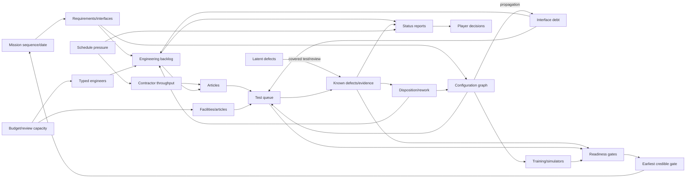
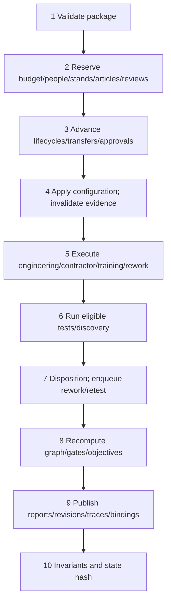

# Scenario design specification: Apollo Integration, 1966

| Field | Contract |
|---|---|
| ID | `apollo-integration-1966` |
| First release | **Fictional analytic:** Program Asteria, using Apollo-derived mechanisms without historical people or accidents as game pieces |
| Later variant | Research-gated `apollo-historical-desk`, January 1966–June 1967 |
| Role | Composite Director of Program Control and Integration |
| Clock | 18 monthly turns |
| Status | Implementation-ready proposal; not implemented, calibrated, historically validated, or educationally validated |
| Build verdict | **Go after Gate C project/dependency primitives; do not build next.** |

## Design verdict

Build the fictional analytic version first. It preserves the valuable Apollo-shaped problem—coupled development, test queues, configuration propagation, contractor reports, workforce specialization, and mission sequencing—without inviting a player to “beat” a fatal historical accident. The historical variant is separate content, not a skin; it requires historian, safety, period-information, and ethics reviews.

This is the suite’s project-model test. Implement it only after scenario-owned runtime types, dependency graphs, typed queues, action/resource calendars, report revisions, and structured traces exist. Write one typed scenario plugin, not a universal project DSL.

## Thesis, learning, and transfer

**Thesis:** In a tightly coupled development program, tests create information rather than merely certify progress: concurrency can trade visible calendar time for hidden interface debt, while disciplined configuration, slack, and discovery can make reported progress look worse before the program becomes genuinely more ready.

Target intuitions:

1. A failed test can improve the decision position by converting latent uncertainty into bounded rework; few known defects may mean little was tested.
2. A late change costs more than local engineering because dependent hardware, software, procedures, simulators, and prior evidence may become stale.
3. Engineers, test stands, articles, contractor throughput, and review attention are typed, delayed, and non-fungible.

Target misconceptions:

- percent complete is a monotone physical stock;
- parallel activity always shortens the critical path;
- a freeze eliminates rather than exchanges risk;
- defect discovery is managerial deterioration;
- adding engineers creates immediate effective capacity;
- a green report is flight-configured evidence;
- redundancy edits a fixed probability of success; and
- Apollo’s outcome proves one management system was optimal.

The desired pattern is: establish credible baselines, expose interfaces early, protect integration tests, resist activity-based optimism, freeze selectively, accept a justified slip, and preserve option value.

The transfer task is a vaccine scale-up whose product, assay, fill-finish, cold-chain, documentation, and training interfaces share validation facilities. Transfer succeeds when the player asks which evidence is configuration-valid, predicts propagation, treats discovery as information, protects the validation bottleneck, and rejects a date unsupported by prerequisites.

Non-goals are spacecraft design, orbital mechanics, Apollo biography, the cause of the Apollo 204 fire, a general theory of innovation, or a probability of crew loss.

## Role and authority

**Director of Program Control and Integration** is explicitly composite, compressing a headquarters program office, center project offices, systems/interface panels, configuration-control boards, test and flight-operations organizations, safety/quality functions, and prime contractors.

The player may:

- allocate a bounded central reserve of engineers and specialist support;
- prioritize declared test facilities and integration articles;
- convene interface, configuration, contractor, and independent safety reviews;
- approve delegated changes or refer major changes to a program board;
- order root-cause work, rework, and configuration-valid retest;
- fund bounded overtime, duplicate articles, tooling, redundancy studies, and contractor recovery;
- recommend mission resequencing, an uncrewed step, or a schedule slip; and
- defer lower-priority work in the modeled portfolio.

The player may not directly design systems, command center/contractor/crew staff outside delegated channels, create skill or facilities instantly, waive crew-safety prerequisites, change the national mandate or appropriation, conceal a known critical hazard, order a launch, or see hidden truth.

Major configuration, mission-sequence, and crew-safety recommendations have an approval delay. Exogenous actors include agency leadership, Congress/executive, center and contractor leaders, independent safety authorities, suppliers, and engineering physics.

Resources are engineer-person-months (`EPM`), `review-slot/month`, `stand-month`, test `article`, and integer thousands of fiscal-1966 US dollars (`kFY66USD`). All magnitudes and ranges are TBD.

## Historical, ethical, and claim boundary

The first release is fictional. Historical sources establish mechanism candidates, not values or causal proof. The [Phillips review](https://www.nasa.gov/history/phillips-report/) documented late facilities, schedule slippage, qualification problems, fragmented control, unresolved work, and weak reporting against plan; the model may represent these classes, not universalize its judgments.

On 27 January 1967 the Apollo 204 ground-test fire killed Virgil I. Grissom, Edward H. White II, and Roger B. Chaffee. The [Apollo 204 Review Board](https://www.nasa.gov/missions/apollo/apollo-1/report-of-the-apollo-204-review-board/) documented technical, configuration, test-procedure, certification, and organizational findings. Their deaths are not a random event, score, counterfactual reward, or animation.

If Historical Desk is approved:

- the fire is a fixed documentary boundary, never caused, prevented, delayed, or modified by player action;
- no branch compares casualties or treats the crew as objective values;
- pre-fire play ends before it and presents a sourced documentary interlude;
- playable recovery begins only from released findings;
- the AAR forbids “would have prevented” claims; and
- the crew remain named in briefing/debrief, not abstracted into loss points.

The scenario may claim that its declared configuration, testing, capacity, reporting, and coupling mechanisms alter modeled readiness, rework, and schedule. It must not claim to explain Apollo’s success, accident causation/preventability, blame, real mission safety, or what NASA should have done.

## Model boundary

Endogenous: seven workstreams; dependency/interfaces; known and latent work/defects; rework/evidence; configurations and changes; workforce ramp/overload; contractor WIP/quality/throughput; tests, articles, facilities, queues, and results; training alignment; budget; critical path; mission sequence; safety-evidence gates; reports, optimism, audits, and revisions.

Exogenous/keyed: opening latent-defect population/detectability, productivity regime, supplier variance, independent facility interruption, board response time, mandate, and appropriation.

Outside: detailed vehicle physics, geopolitics, procurement law, labor relations and discrimination, individual appraisal, astronaut selection, launch/in-flight operations, and casualties.

## Causal and dependency diagram



Reinforcing loops are change propagation and schedule-pressure optimism. Balancing loops are discovery, root-cause correction, valid retest, and rebaselining.

## Minimum state contract

Workstreams are `launch-vehicle`, `crew-spacecraft`, `landing-spacecraft`, `guidance-software`, `ground-systems`, `test-facilities`, and `crew-operations`. Historical mappings require review.
Work kinds are requirements/design, fabrication/software build, integration, analysis, rework, and training. Specialty pools are systems/interface, vehicle/mechanical, electrical/guidance/software, test/quality/safety, and ground/operations; organizations are the program office and workstream center/prime aggregates. Facilities are typed component, propulsion/structural/environmental, integrated-checkout, and crew/mission-simulation calendars.

| ID | Kind/unit | Live visibility | Provenance | Cadence/use |
|---|---|---|---|---|
| `work.remaining[w,k]` | hidden stock, EPM | estimate range | analytic; values TBD | monthly true workload |
| `work.knownBacklog[w,k]` | known stock, EPM | reported | derived | monthly allocation |
| `maturity[w]` | p10/median/p90 fraction | fan | analytic | monthly; never edited |
| `interface[e].baseline` | configuration ID | exact record | sourced structure | event-driven identity |
| `interface[e].debt` | analytic points | range | analytic; scale TBD | monthly propagation proxy |
| `defect[d]` | object: severity/state | known subset | sourced structure; population TBD | discovery/rework |
| `rework[w]` | stock, EPM | range | derived | monthly feedback |
| `evidence[q,c]` | coverage fraction | exact if released | sourced structure | per test/configuration |
| `configuration[w]` | version ID/age months | exact | sourced structure | event-driven |
| `changeQueue[ecp]` | change objects | exact status | sourced structure | board cadence |
| `testQueue[q]` | stand-month queue | booking exact; duration range | sourced structure | monthly |
| `facility[f]` | stand-month/month | exact booking | structure; values TBD | monthly |
| `article[a]` | article/status/config ID | exact custody | sourced structure | event-driven |
| `workforce[s,o]` | EPM/month | reported | analytic; values TBD | monthly |
| `workforce.effective[s,o]` | EPM/month | range | derived | ramp/overload |
| `contractor[w]` | WIP/deliverable-equivalent/month | lagged | structure; values TBD | monthly |
| `trainingAlignment` | fraction current | reported | analytic | monthly |
| `budget` | kFY66USD ledger | exact | structure; values TBD | monthly |
| `earliestReadyGate` | month-index distribution | fan | derived | critical path |
| `scheduleMargin` | months | current vintage | derived | monthly |
| `hazard[h]` | severity/state object | known subset | structure; values TBD | event-driven |
| `technicalRiskBand` | ordinal | band+basis | analytic | not casualty probability |
| `reportBias[r]` | percentage points | hidden until AAR | analytic; range TBD | reporter/regime |
| `metrics` | declared cumulative units | visible subset | derived | monthly/AAR |

Every defect, hazard, article, test, change, report, and configuration has a stable ID. Aggregates are views, not authoritative replacements.

## Transition mechanisms and phase order

- Work completion is bounded by ready backlog, effective specialty capacity, article/tool availability, contractor throughput, and released prerequisites; unused typed capacity is not reassigned.
- Transfers enter onboarding before becoming effective. Sustained overload changes future capacity and quality-escape exposure through declared, sensitivity-tested functions.
- A latent defect has keyed identity, origin, affected interfaces, severity, detectability, and correction burden. Only a covering test/review against the matching configuration can reveal it.
- Defect lifecycle is `latent → known-open → analyzing → dispositioned → correcting → awaiting-retest → closed|accepted-uncrewed`; only declared actions/tests move it.
- Candidate discovery rule: $p_{detect}=1-\exp(-coverage \times detectability)$; form and parameters remain TBD.
- A failed test adds knowledge, disposition, rework, and retest. It never subtracts arbitrary maturity.
- A change updates fingerprints, adds dependent rework and keyed defect exposure through edge sensitivity, change scope, and downstream progress, and invalidates only overlapping evidence.
- Freeze limits ordinary admission but cannot close hazards or block a safety-critical reopen.
- Maturity derives from configuration-valid evidence, remaining-work uncertainty, known defects, and dependencies; it is not success probability.
- The solver recomputes critical paths from graph, queue, capacity, rework, and approval calendars. `scheduleMargin = committedGateMonth - earliestReadyGate`.
- Technical risk is ordinal and evidence-based; no transition samples injury/death or directly edits risk.
- Reports combine evidence-backed progress, aggregation error, and schedule-pressure optimism; audits publish revisions without changing truth.



No newly approved change may claim old evidence; same-turn discover–repair–retest is impossible.

## Explicit 18-month arc

| Turn | Phase | Designed decision |
|---:|---|---|
| 1 | Baseline | Separate evidence-backed dates from unowned interface claims. |
| 2 | Baseline | Locate typed capacity hidden by nominal staffing. |
| 3 | Baseline | Commit first forecast, audit, and reserve before discovery. |
| 4 | Converge | Select interface freezes with safety reopen paths. |
| 5 | Converge | Book qualification/integration slots against prerequisites. |
| 6 | Converge | Accept or reject contractor recovery and rebaseline claims. |
| 7 | Qualify | Early tests turn latent defects into visible rework. |
| 8 | Qualify | Root-cause, contain, propagate, or defer a defect. |
| 9 | Qualify | Reconcile path, evidence, and training configuration. |
| 10 | Integrate | Assemble the first cross-workstream article. |
| 11 | Integrate | Protect coupled test/simulation from local schedule claims. |
| 12 | Integrate | Forecast readiness before independent safety review. |
| 13 | Stress | Conditional hold/finding exposes stale evidence. |
| 14 | Recover | Choose scope, redundancy, rework, and sequence response. |
| 15 | Recover | Freeze a revised baseline or retain option value. |
| 16 | Demonstrate | Run pinned end-to-end uncrewed readiness campaign. |
| 17 | Gate | Resolve critical findings; rehearse go/no-go reasoning. |
| 18 | Handover | Recommend proceed, hold, or resequence; enter AAR. |

Guided mode fixes variant strata and unlocks views progressively; Professional exposes legal actions from turn 1; Sandbox reveals parameters/truth only post-run.

## Eight action families

All use `committed → queued → implementing → active → completed|failed|cancelled`. Validation previews commitments/prerequisites, not outcomes.

| Family | Decision/direct cost | Delay and implementation | Mechanism |
|---|---|---|---|
| Workforce allocation | specialty EPM, budget, coordination | transfer → onboarding → effective; TBD | typed capacity/ramp |
| Test program | stand-month, article, prep EPM, budget | plan → configure → run → analyze → release | discovery/queue |
| Configuration control | review slots, analysis, rework exposure | board → impact review → directive → propagation | stability/learning |
| Defect disposition | EPM, article, retest, budget | investigate → repair/change → inspect → retest | knowledge/rework |
| Reviews and audits | systems EPM, review slots | commission → collect → preliminary → final/revised | information value |
| Concurrency/support | budget, QA/systems EPM, setup | authorize → ramp → active → unwind | time/debt trade |
| Mission sequence/schedule | planning/training EPM, review slots, budget | study → external approval → rebaseline → retrain | slack/options |
| Safety/redundancy/scope | budget, EPM, article and stand claims | study → approve → design/change → qualify | mechanism-based risk |

No action sets completion, defects, maturity, margin, or risk directly.

## Observation, optimism, and revisions

| Hidden state | Proxy | Lag/status | Information/revision |
|---|---|---|---|
| true remaining work | milestone report and evidence completion | monthly preliminary | contractor audit/evidence review |
| latent defects | anomaly trend, coverage, fan width | undiscovered | targeted/integrated test |
| interface debt | stale ICDs, divergent fingerprints, open actions | monthly | interface audit |
| effective workforce | nominal staff, ramp, overtime, output | monthly | skills review |
| throughput/yield | accepted deliveries, WIP age, rejection/rework | one month | resident team/quality audit |
| future stand capacity | booking/readiness range | live+warning | readiness review |
| earliest date | competing assumption-labeled forecasts | monthly vintage | rebaseline |
| safety sufficiency | independent hazard/coverage gaps | event-driven | protected review/test |

Reports persist `eventTurn`, `asOfTurn`, `publishedTurn`, `status`, `methodology`, `confidence`, and `revisesReportId`. Optimism is an observation process, not a moral trait: pressure, fragmented evidence, and rebaselining may widen/bias status; independent evidence can revise it. “Green” decomposes into evidence, assumptions, and reporter regime. Historical Desk exposes only period-available information.

## Stress events

| Event | Trigger/warning | Mechanism and mitigation |
|---|---|---|
| Delivery re-estimate | enough acceptance data; WIP-age warning | revise hidden backlog/date; audit narrows but cannot erase |
| Compatibility defect cluster | first eligible pinned integration test; interface-debt warning | reveal keyed latent interfaces; earlier reconciliation changes exposure |
| Crew-safety evidence hold | turn 13 if critical coverage/configuration fails; gaps visible | fictional, no injury; block recommendation and create corrective work |

Events reveal modeled state, never subtract arbitrary progress. Historical Apollo 204 content follows only the separate ethical contract.

## Objective vector, failures, views, and forecasts

Objectives are lexicographic, never one score:

| Priority | Objective/measure | Type |
|---:|---|---|
| 1 | no crewed-readiness recommendation with known critical hazard, stale configuration, or missing evidence | hard red line |
| 2 | configuration/evidence integrity: unowned changes, unknown fingerprints, invalid evidence | hard |
| 3 | credible uncrewed integrated gate: prerequisite/evidence vector | hard horizon |
| 4 | truthful recoverable schedule: margin distribution and late surprises | soft |
| 5 | budget/capacity: completion forecast, queue delay, overload months | soft |
| 6 | option/capability: reserve, expert attrition, irreversible deferral | soft |

Failure is recorded—not dramatized—on a red-line recommendation, unrecoverable traceability loss, exhausted budget with mandatory corrections unfunded, or gate slippage beyond a calibrated mandate window (thresholds TBD). The run reaches turn 18 unless software invariants fail and ends at recommendation, not launch.

Views: Situation Room; Dependency Graph; versioned Gantt; Test/Defect Board; Configuration Room; Workforce/Contractors; Reports/Decision Book.

At most 12 headline KPIs: critical-path evidence, earliest-ready month, margin, open critical hazards, divergent interfaces, known weighted defects, rework EPM, test queue, valid coverage, effective/nominal workforce, budget at completion, latest schedule revision. Defects and coverage remain adjacent.

Each commit forecasts the next binding resource/prerequisite, earliest gate range, two-turn high-severity discovery range, margin change/mechanism, configuration validity, and conditional proceed/hold/resequence. Score numeric coverage/width, categorical Brier score, and directional mechanism accuracy.

## Causal trace contract

Every headline delta/objective transition records stable ID, turn, target, signed amount/unit, mechanism/phase, source state and prior value, related action/event/defect/change/test/article/configuration/report IDs, requested/available/realized/deferred quantities, binding prerequisite, current-visible explanation, AAR explanation, and parameter/source status.

Mechanisms: `engineering-completion`, `transfer-ramp`, `coordination-load`, `contractor-acceptance`, `test-discovery`, `defect-rework`, `change-propagation`, `evidence-invalidation`, `training-realignment`, `critical-path-shift`, `report-revision`, `budget-settlement`, `safety-gate`.

Bindings cover specialties, stands, articles, contractor throughput, reviews, budget, configuration, predecessors, and safety evidence. Additive traces reconcile exactly; dates/bands record old/new critical paths and changed nodes/edges. Live trace never leaks latent defects/bias; AAR labels it model arithmetic, not history.

## AAR, counterfactuals, and transfer

Use the platform sequence: intent → events/reports → outcomes → bottlenecks → luck/policy → alternatives → hidden truth → principles → transfer → replay.

Required exhibits:

1. forecasts versus every report vintage, realization, and final revision;
2. evidence-backed maturity fan with discoveries;
3. configuration genealogy and invalidated-test map;
4. critical-path/binding-resource timeline;
5. test queue, utilization, discovery, rework, and retest waterfall;
6. nominal/effective workforce and overload;
7. schedule-margin waterfall by work/change/test/report/decision;
8. objective distributions against baselines on matched seeds;
9. unknowable versus unmeasured versus neglected state; and
10. model card, variants, and nearest informative branch.

Branches occur at first freeze, integrated-test booking, consequential defect disposition, and slip decision. They compare model distributions, never historical outcomes. Transfer asks why failed validation can be progress, when freeze destroys options, when central review helps/hurts, and what evidence survives change.

## Baselines

| ID | Rule and expected behavior |
|---|---|
| `minimal` | preserve allocations; mandatory work only; stable appearance, missed evidence/path |
| `deadline-reactive` | parallelize/freeze early, overtime after red reports, resist slips; early green, late rework/tail |
| `evidence-buffer` | typed reserve, early coupled tests, selective freeze, evidence-based slip; ordinary-seed competence |
| `historically-inspired-control` | interface ownership, CCB review, staged qualification/integration, resequencing; not “NASA policy” |
| `adversary` | probe rounding, cancellation, reuse, report gaming, final-turn dumping, spam |

## Invariants, tests, and 100 seeds

Invariants:

- deterministic initialization/step/visibility/replay/branch/save-load and pinned engine/scenario/model/content/RNG/parameters;
- no ambient RNG, time, network, browser, React, filesystem, or LLM;
- finite bounded values; exact EPM, stand, review, article-custody, and budget reconciliation;
- no work before prerequisites/delays; one custody/status/configuration per article;
- tests consume bookings and record fingerprint; invalid evidence cannot satisfy gates;
- stable defect IDs/legal transitions; no same-turn discover–repair–retest;
- changes cannot create work completion/evidence/maturity without trace;
- critical path equals declared graph/calendars;
- report vintages do not leak truth; mandatory safety gates cannot be waived; and
- objective bounds and complete headline trace/binding coverage.

Tests: initialization; all actions/authority/lifecycles; graph cycle/tie; workforce ramp/overload; contractor WIP/acceptance; facility/article queue; keyed discovery; dispositions/retest; propagation/selective invalidation; optimism/revision; warnings/events; objectives/failures; visibility; replay/branch/save-load; baselines; extremes; trace reconciliation.

100-seed expectations:

- 100/100 pass replay, serialization, finiteness, ledgers, graph, visibility, safety, and trace invariants.
- Evidence-buffer never recommends crewed-go in ordinary variants (policy invariant).
- Deadline-reactive has better early reported schedule but worse late revision/rework tail than evidence-buffer; preregister threshold after calibration.
- Test-forward has more early known defects but lower median late latent burden; effect size TBD.
- Matched high-coupling seeds weakly increase propagation; matched optimistic reporting weakly increases revisions without changing truth.
- Baselines differ on a hard/process measure; none dominates every objective/seed.
- Adversary finds no resource creation, stale-evidence reuse, spam advantage, or final-turn exploit.

Non-software thresholds stay TBD until review, then freeze before Monte Carlo.

## Parameters and interpretive variants

Register fields: `id, dimensions, unit, value_or_distribution, bounds, provenance_tag, source_link/page, derivation, uncertainty, sensitivity_priority, version, parameter_set, notes`. Allowed tags: `sourced`, `derived`, `calibrated`, `assumed-analytic`, `fictional-interface`. **No numerical calibration is approved here.**

Calibration order: freeze fictional graph/semantics; extract documented ranges; elicit EPM/test/defect/propagation ranges; tune delays for legibility; calibrate qualitative baselines without fitting the landing; hold out patterns; freeze variants/seed keys.

Required variants:

- `coupling-local` / `coupling-systemic`;
- `discovery-component-early` / `discovery-integration-late`;
- `reporting-neutral` / `reporting-schedule-optimistic`;
- `workforce-rigid` / `workforce-transferable-with-ramp`;
- `incremental-test-value-high` / `all-up-integration-value-high`; and
- `formal-control-high-benefit` / `formal-control-high-overhead`.

The last pair addresses interpretive uncertainty: scholarship debates attributing Apollo’s success to systems engineering, while archives also show control failures and information costs. The AAR compares variants without declaring one historical truth.

## Exploits and misleading lessons

| Risk | Countermeasure |
|---|---|
| avoid tests to hide defects / add every test | evidence gates and latent AAR / scarce capacity and overlap |
| freeze instantly / reopen constantly | uncertainty and safety reopen / propagation, invalidation, review load |
| parallelize or hire at deadline | setup, QA/systems claims, onboarding, typed skills |
| reuse evidence after change | fingerprint and coverage-overlap checks |
| accept hazards or slip forever | uncrewed-only bounds/safety gate / mandate, budget, credibility |
| dump scope in turn 18 | approval delay and deferred-work handover |
| audit constantly | review/EPM cost and overlapping-report limit |
| learn bureaucracy or heroic urgency “caused success” | overhead variant, no hero variable, transfer prompts |
| treat workers as fungible | specialties, organizations, ramp, overload, model-card warning |
| infer accident preventability | fictional primary plus fixed historical boundary |

## Runtime, package, and model card

Preserve pure deterministic step, event-sourced decisions, immutable turn records/hashes, replay/branching, hidden-state projection, structured reports, traces, bindings, vector objectives, and local-first operation.

Gate C adds: `ScenarioModel<State, Decision, Visible>` envelope; validated project graph/critical path; resource calendars/queues; fingerprints/change propagation/evidence validity; test/defect/hazard/article records; declared Gantt/dependency/fan-chart models; scenario-owned units/bindings.

Package contract:

```text
scenarios/apollo-integration-1966/
  manifest.json  briefing.md  learning-design.md  causal-model.md
  entities.json  variables.json  actions.json  observations.json
  events.json  objectives.json  forecasts.json  views.json  debrief.json
  parameter-register.csv  sources.json  model-card.md  model/  tests/
```

The typed model remains authoritative. An LLM may draft visible staff/AAR prose from logged records; it cannot allocate, reveal truth, change parameters, adjudicate tests, or score causality.

The model card must disclose fictional/composite status; historical and Apollo 204 boundary; intended and prohibited uses; model/observation/event/objective boundaries; that risk bands are not casualty/success probabilities; variants/high sensitivities; provenance/TBDs; workforce abstraction and no employee assessment; keyed uncertainty; trace limits; separate software/model/game/history/learning validity; local privacy; no LLM causal role; and graph/Gantt/color/keyboard/reduced-motion accessibility.

## Source register and access

Checked 26 July 2026. Access labels distinguish material actually inspected from complete public files merely located; no source is treated as calibrated data.

### Primary/official — access stated per item

- **Phillips management review, 1965–66:** full NASA HTML; schedule, facility, qualification, work-control, and reporting mechanisms, no coefficients. [NASA](https://www.nasa.gov/history/phillips-report/).
- **Apollo 204 Review Board, 1967:** full NASA HTML/report structure; accident boundary and configuration/test/certification/organizational findings. [NASA](https://www.nasa.gov/missions/apollo/apollo-1/report-of-the-apollo-204-review-board/).
- **NASA SP-287, *What Made Apollo a Success?*:** NTRS metadata/abstract and selected searchable text inspected; complete public PDF located but not read cover-to-cover. Supports tests, reviews, interfaces, redundancy, sequencing, and training; retrospective attribution is not calibration. [NTRS](https://ntrs.nasa.gov/citations/19720005243).
- **NASA TN D-7610, thermal-vacuum testing:** official PDF abstract/searchable text inspected; complete public PDF located. Integrated tests disclosed equipment/procedural deficiencies; structural use only. [NTRS PDF](https://ntrs.nasa.gov/api/citations/19740012430/downloads/19740012430.pdf).
- **Apollo Inter-Center ICD procedure, 1969/70:** full 34-page PDF; interface identification/control/accounting/repository. Post-period, so not early Historical Desk knowledge. [NTRS PDF](https://ntrs.nasa.gov/api/citations/19700025361/downloads/19700025361.pdf).
- **Bellcomm software-management control, 28 September 1966:** catalogue/download identified, detailed extraction pending; no parameter or detailed claim. [NTRS](https://ntrs.nasa.gov/citations/19670002838).

### Official history — complete public PDFs located; relevant text inspected

- Brooks, Grimwood, and Swenson, *Chariots for Apollo* (NASA SP-4205): selected relevant text inspected for chronology, development, tests, contractors, and recovery; not read cover-to-cover. [NASA PDF](https://www.nasa.gov/wp-content/uploads/2023/03/sp-4205.pdf).
- Ertel and Newkirk, *Apollo Spacecraft: A Chronology*, vol. IV (SP-4009): selected searchable text inspected for date checking; no state values extracted. [NASA PDF](https://www.nasa.gov/wp-content/uploads/2023/03/sp-4009vol4.pdf).
- Launius, *Apollo: A Retrospective Analysis* (SP-2004-4503): full PDF available and relevant institutional/retrospective sections inspected; not read cover-to-cover. [NASA PDF](https://www.nasa.gov/wp-content/uploads/2023/04/sp-4503-apollo.pdf).

### Strong scholarship

- Tucker and Alewine, “Roles of Management Control,” *Contemporary Accounting Research* 40 (2023): open full text; archives plus 30 interviews support facilitating/influencing controls; observation design only. [DOI/full text](https://onlinelibrary.wiley.com/doi/10.1111/1911-3846.12833).
- Johnson, *The Secret of Apollo* (JHU Press): publisher description/limited preview only; identifies systems-management interpretation, no uninspected detail. [Publisher](https://www.press.jhu.edu/books/title/2845/secret-apollo).
- Osann, “Discourses of Systems Engineering,” *Engineering Studies* 5 (2013): full publisher HTML; supports disputed success attribution. [DOI/full text](https://doi.org/10.1080/19378629.2013.795575).
- Mindell, *Digital Apollo* (MIT Press): publisher/sample only; candidate for later guidance/software research, not calibration. [MIT Press](https://mitpress.mit.edu/9780262134972/digital-apollo/).

### Local — full access

User-provided `serious-systems-simulation-engine-spec.md` §§15, 17.5, 18, 19,
Appendices A–B; repository `CLAUDE.md`, architecture/model card/scenario README,
`src/lib/sim/types.ts`, and Narrows package/runtime.

### Input-status ledger

| Status | This specification |
|---|---|
| Primary/official and secondary scholarship | categorized above with access status |
| Sourced numerical inputs | none approved |
| Derived | maturity fan, interface debt, effective capacity, critical path/margin, risk band, objectives, metrics |
| Calibrated | none; all future values require a versioned register |
| Assumed-analytic | discovery form, workforce ramp/overload, propagation, optimism, and event distributions |
| Fictional-interface | Program Asteria names, composite role, workstream aggregation, stress-event narrative, KPI presentation |

## Unresolved risks and gates

Risks: composite authority; entirely TBD numerical calibration; a fictional hold still reading as an Apollo 1 puzzle; management monocausality; severity-point abstraction; EPM erasing human agency/craft/labor conditions; monthly order artifacts; graph UI overload; post-period information leakage; and confusing plausibility with validation.

Release gates: source/role dossier; accident ethics review; unit-complete register; invariant-clean headless model; preregistered 100-seed baselines; exploit/model-card/accessibility audits; historian, systems/test, contractor-program, and safety SME review; novice playtest; transfer study; and explicit “candidate, not validated” label.
