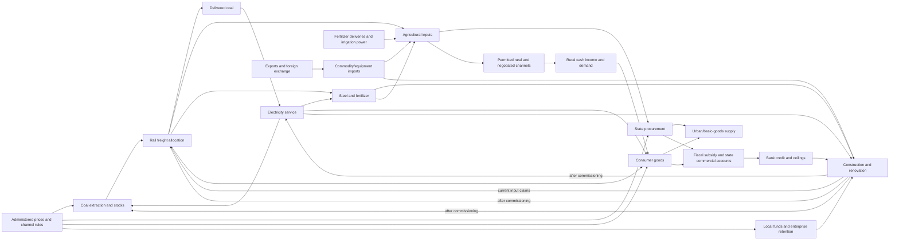

# Scenario design specification: Bottleneck Economy, 1981

| Field | Decision |
|---|---|
| Scenario ID | `bottleneck-economy-1981` |
| Design status | Implementation-oriented research specification; **not calibrated, implemented, historically validated, or learning-validated** |
| Fidelity | Historically grounded counterfactual with an explicitly composite central role |
| Player role | Deputy Convenor, Joint National Economic Adjustment Desk, spanning State Planning Commission and State Economic Commission staff functions |
| Clock | 1981 Q1–1983 Q4; 12 quarterly turns |
| Runtime | Future pure TypeScript scenario plugin plus declarative package; no LLM in the causal loop |
| Build verdict | **Capstone; do not build in the near term.** Specify now, implement only after narrower primitives and expert review. |

## Verdict and dependency gate

This is the library’s strongest capstone and the wrong next implementation. Its failure problem is not “planning versus markets,” but managing moving coupled constraints while administrative allocation, limited negotiated channels, enterprise incentives, local initiative, credit, and incomplete information coexist.

The current runtime’s types and content encode Narrows’ weekly two-cargo crisis. Deterministic stepping, replay/branching, visibility, report vintages, action lifecycles, vector objectives, bindings, and contributions transfer; the sector model does not.

Implementation waits until narrower scenarios demonstrate:

1. a generic `ScenarioModel<State, Decision, Visible>` with scenario-owned types;
2. unit-checked multi-good ledgers and sector recipes;
3. planned and limited-market channels without double counting;
4. project cohorts with WIP, commissioning, suspension, and sunk costs;
5. signed fiscal, credit, enterprise-fund, and FX ledgers;
6. partial local/enterprise compliance;
7. swappable named mechanism variants and sensitivity ensembles; and
8. traces separating physical bindings from behavioral responses.

Before code, obtain independent review by a PRC reform-era economic historian, Chinese planning-institutions specialist, agriculture and energy/transport specialists, Chinese-language source reviewer, and simulation/learning reviewer. The period crosses institutional reorganization and rapid rural change; a static role or “reform intensity” slider would mislead.

## One-sentence pedagogical thesis

**Reform in a shortage economy is the management of a moving, coupled constraint system: changing an incentive, allocation, price, credit rule, or investment priority can release one flow while diverting inputs, widening another queue, increasing fiscal or monetary pressure, or creating a later capacity gain.**

## Learning design and transfer

Target intuitions:

1. **The bottleneck moves:** extraction, rail haulage, generation, grid service, and end-use efficiency can bind in sequence.
2. **Incentives act through constrained channels:** price or retention can change effort, mix, deliveries, and investment demand, but cannot instantly create capacity or transport.
3. **Starts claim present resources before adding future capacity:** projects consume credit, steel, power, rail, and construction service before commissioning.

Target misconceptions include automatic market clearing; costless central reallocation; price-as-instant-supply; local starts as guaranteed useful capacity; one national agricultural-reform switch with settled causation; a mature nationwide industrial dual-price regime in 1981; and historical growth as proof of one correct counterfactual.

The intended arc is broad priority orders → infeasible requested allocations → diagnosis using dated reports → sequenced projects, selective incentives, bounded marginal channels, protected plan deliveries, and a forecast of the next constraint.

Transfer uses a fictional regional decarbonization system with generation, transmission, storage, industrial loads, crews, imported equipment, local borrowing, and regulated tariffs. Success means separating installed capacity from delivered service, predicting the next binding constraint, distinguishing price signals from physical responses, limiting simultaneous starts, preserving buffers, and naming conclusions dependent on disputed elasticities.

Non-goals: a general theory or moral ranking of planning and markets; household welfare; Party politics; ethics of reform; exhaustive institutional/provincial reconstruction; forecasting China; or estimating what “would have happened.”

## Role contract

### Appointment and institutional coherence

The institutions are real; the job is not. The player is a **composite staff coordinator** reporting to a State Council economic coordination meeting. It combines the State Planning Commission’s longer-horizon/large-project balance work with the State Economic Commission’s shorter-term preparation, execution, and coordination. That split is clearest after the 1982 reorganization and is a disclosed continuity device, not a literal 1981 chart ([contemporaneous account, pp. 5–6](https://documents1.worldbank.org/curated/en/488481468240897320/pdf/multi_page.pdf)).

One quarterly package represents completed interagency concurrence. Every lever is labeled `coordinate`, `recommend`, `approve`, or `request`; no single official commands all sectors.

### Modeled authority

The player may coordinate quarterly material/freight balances; recommend annual-plan, major-project, administered-price, and procurement revisions; approve, defer, suspend, or refer projects within declared limits; negotiate credit ceilings/investment guidance; condition enterprise retention and eligible above-plan sales; prioritize sector programs; assemble trade packages inside an FX envelope; and commission audits, censuses, reconciliations, or consultations.

### Authority limits and exogenous actors

Households, production teams, enterprises, bank branches, provinces, ministries, dispatchers, and foreign suppliers are not one machine. Central bodies set the mandate, while price, finance, banking, sector, trade, provincial, collective, and enterprise actors retain responsibilities; compliance, bargaining, reporting, and implementation are mechanisms.

Weather, hydrology, inherited capacity, world prices, crop calendars, and responsibility-system diffusion are exogenous or slow. The player changes procurement terms and input support, not a quarterly national household-farming share. Political purge, coercion, protest, mortality, and legitimacy are not simulated.

### Information set and resources

The desk receives dated, revisable plan/material balances; rail and grid dispatch; credit/project returns; provincial construction; enterprise profit/inventory/retention; procurement, rural-market, crop/input; and trade/FX accounts. Historical Desk reveals only reports available then; Analytic mode adds uncertainty/binding diagrams; Sandbox reveals parameters and truth only after one run.

Each policy change, investigation, and cross-sector priority consumes fictional `coordination-work units` (`CWU`); unfinished initiatives retain claims. CWU values are design parameters, never historical headcounts.

## Historical and claim boundary

The setting is 1979–83 adjustment and early reform, not generic “transition.” A late-1981 report framed adjustment as stabilization and efficiency, prioritizing agriculture, consumer goods, conservation, energy/transport, renovation, enterprise responsibility, and cautious reform ([public transcription](https://zh.wikisource.org/wiki/1981%E5%B9%B4%E4%B8%AD%E5%8D%8E%E4%BA%BA%E6%B0%91%E5%85%B1%E5%92%8C%E5%9B%BD%E5%9B%BD%E5%8A%A1%E9%99%A2%E6%94%BF%E5%BA%9C%E5%B7%A5%E4%BD%9C%E6%8A%A5%E5%91%8A); [official chronology](https://cpc.people.com.cn/BIG5/64162/64164/4416120.html)).

Official 1981 reporting paired flat coal, higher electricity, slightly lower rail-freight turnover, and sharply higher Shanxi coal haulage with higher procurement prices, more negotiated/above-quota purchases, rural-market diversion, supply-demand mismatch, and simultaneous shortages and inventories ([NBS full HTML](https://www.stats.gov.cn/sj/tjgb/ndtjgb/qgndtjgb/202302/t20230206_1901924.html)). These are **reference patterns**, not calibration targets or causal proof.

The model uses an **incipient two-channel system**: planned obligations/administered prices remain central; eligible above-plan output, negotiated prices, direct links, rural fairs, and collective/individual commerce are bounded additions. Contemporaneous analysis reports these openings alongside tighter 1981 price control, territorial fragmentation, and material allocation ([World Bank full PDF](https://documents1.worldbank.org/curated/en/488481468240897320/pdf/multi_page.pdf)). It must not import the broader mid-1980s industrial dual-price regime ([Rawski, pp. 3–6](https://documents1.worldbank.org/curated/en/818801468913842220/pdf/Chinese-industrial-reform-accomplishments-prospects-and-implications.pdf)).

Permitted claims: within declared equations, simultaneous investment tightens current constraints before capacity arrives; price, procurement, retention, and channel changes produce delayed, bounded physical, fiscal, and investment responses; historically, early reform mixed planning, decentralization, retention, credit, limited negotiated channels, rural responsibility systems, and administrative tightening.

Prohibited claims: that one scalar measures reform; response coefficients are known; central orders were fully implemented; household contracting alone explains rural gains; only prices or only capacity caused shortages; small-scale expansion was socially costless; or modeled counterfactuals establish an alternative history.

## Causal sector map

Key loops are the `coal → rail → power → coal` service loop; the `agricultural incentives/inputs → output → procurement and rural demand → consumer-goods pressure` loop; and the `retained/local funds and credit → project starts → current bottleneck load → later capacity` loop.
No arrow implies a settled historical magnitude.

## Model contract

### Sets, units, and provenance tags

- Sectors `S`: `agriculture`, `coal`, `electricity`, `rail`, `steel`, `fertilizer`, `consumer-goods`, `construction`.
- Tradables `G`: selected grain/fertilizer/coal/steel/equipment/consumer/export bundles; no universal commodity list.
- Channels `C`: `plan`, `negotiated`, `rural-market`, `import`, `export`.
- Project classes `P`: `coal`, `power`, `rail`, `fertilizer`, `technical-renovation`, `consumer-goods`, `local-small-scale`.
- Physical units: Mt, TWh, billion tonne-km, and sector-specific capacity per quarter.
- Financial units: million current yuan, million 1980-constant yuan where deflated, and foreign-exchange units with an explicit conversion table.
- Provenance: `P` primary/official, `S` scholarship, `D` derived identity, `C` calibrated later, `A` declared assumption, `F` fictional teaching construct.
- No elasticity, coefficient, opening stock, shock probability, welfare weight, or mandate threshold is assigned in this document.

### Minimum state and observation cadence

| State ID | Kind / unit | Live visibility | Status | Cadence and decision use |
|---|---|---|---|---|
| `agriculture.outputAndSownMix` | Mt crop-equivalent/q; crop shares | preliminary/lagged range | P+C | seasonal/quarterly; procurement, imports, crop-mix risk |
| `agriculture.inputDelivery` | Mt nutrient and TWh-equivalent/q | reported estimates | P+D+A+C | quarterly; fertilizer/power bottleneck |
| `procurement.obligationAndDelivery` | Mt by crop/channel | obligation exact, delivery preliminary | P+D | quarterly; state supply |
| `stocks.stateGrain` | Mt | delayed/revised | P+C | quarterly; provisioning buffer |
| `output.coalMined` | Mt/q | ministry return | P+C | quarterly; extraction constraint |
| `stocks.coalByNode` | Mt mine/rail/power | incomplete report | A+C | quarterly; locate stranded coal |
| `electricity.capacityAndUnserved` | GW/TWh ceiling and TWh/q | capacity reported; loss revised | P+S+C | current/quarterly; generation and service |
| `rail.capacityRequestRealization` | billion tonne-km/q by cargo | dispatch visible; backlog revised | P+D+C | quarterly; envelope and binding record |
| `output.industry[s]` | Mt, nutrient Mt, or million 1980 yuan/q | ministry return/preliminary | P+C | steel, fertilizer, consumer supply |
| `consumer.demandPressure` | sales-to-supply/backlog index | sampled report | A+C | quarterly; not a utility measure |
| `inventory.byGoodChannel` | physical good units | plan ledger exact; other channels estimated | D+C | quarterly; conservation and mismatch |
| `prices.adminAndNegotiated` | 1980=100 indices/bands | rules exact; negotiated sampled | P+C | policy change/quarterly; channels and incidence |
| `enterprise.obligationAndRetention` | physical obligation and share/rule | authorization exact | P+C | annual/revised; delivery, funds, incentives |
| `funds.retainedAndLocal` | million yuan by source | lagged/estimated/revised | P+S+C | quarterly; enterprise/local starts |
| `credit.ceilingDrawRepayment` | million yuan | ceiling exact; draw lagged | P+D | quarterly; investment pressure |
| `fiscal.subsidyAndBalance` | million yuan | provisional ledger | P+D | quarterly; price/procurement cost |
| `projects[id]` | cohort, work, input claims, status | registered exact; unregistered estimated | A+C | quarterly; current load/future capacity |
| `capacity.sector[s]` | sector output unit/q | reported range | D+C | quarterly; commissions after projects |
| `trade.pipeline[g]` | physical quantity, ETA, FX | contracts exact; arrival uncertain | P+A+C | quarterly; import/export choice |
| `implementation.cwu` | CWU | exact | F | quarterly; action-spam constraint |
| `actor.compliance[k]` | fraction/latent regime | hidden; audit proxy | A+C | slow/quarterly; authority boundary |
| `reports.dataQuality[k]` | bias/lag/revision state | confidence only | A+C | per report; observation boundary |

### Allocation and production rules

Every physical good preserves a channel ledger:

$$I_{g,t+1}=I_{g,t}+Y_{g,t}+M_{g,t}-X_{g,t}-U_{g,t}-W_{g,t}-L_{g,t}.$$

`Y` is output, `M/X` imports/exports, `U` use, `W` project embedding, and `L` declared loss. No unit appears in both plan and negotiated inventories. Plan obligations draw first from eligible output and linked allocations; only eligible residual/released output enters negotiated bands, and rural-market trade is limited to permitted goods after obligations. Unmet plan deliveries become shortfalls/backlogs; bids may remain unmet under territorial and transport frictions.

Industrial output is the minimum compatible limit:

$$q_{s,t}=\min\left(K^{eff}_{s,t},m_{s,t}/a^m_s,e_{s,t}/a^e_s,r_{s,t}/a^r_s,w_{s,t}/a^w_s\right).$$

Only applicable inputs enter; every candidate and near-tie is traced, with coefficients/tolerance in the reviewed register. Generator coal is bounded by mines, node stocks, and realized rail; electricity by capacity, fuel, hydrology, and grid availability; rail by tonne-km, not tonnes. Steam-rail fuel and mine electricity close the coal–rail–power loop.

Agriculture has a seasonal bounded response to weather, crop mix, delivered fertilizer, irrigation service, and a named incentive variant. Responsibility-system diffusion is an uncertain dated exogenous path; procurement affects marginal delivery and crop mix, not output directly.

Project progress is the minimum of eligible work, finance, construction capacity, steel, power, rail, equipment, and CWU. Starts create WIP; suspension preserves or degrades embedded work by declared rule; only completed milestones commission and ramp capacity.

Credit reconciles opening balance, draw, repayment, arrears, and write-off; retained/extra-budgetary funds remain separate from credit and budget. A procurement increase without retail pass-through creates a subsidy claim. No bankruptcy, endogenous money multiplier, or general-equilibrium price solver is implied.

### Immutable quarterly update order

1. validate authority, units, complete package, and forecast entries;
2. reserve CWU, fiscal, credit, foreign-exchange, and registered project commitments;
3. enqueue policy changes, audits, imports, suspensions, and projects;
4. realize keyed weather, hydrology, external delivery, and actor-response states;
5. publish reports whose publication date precedes current dispatch;
6. apply effective price, procurement, retention, credit, and channel rules;
7. advance trade, project, renovation, and information pipelines;
8. compute mine output, node stocks, generation envelope, and rail capacity;
9. allocate rail, electricity, coal, steel, fertilizer, and planned/limited-channel goods;
10. produce agriculture, industry, consumer goods, and project work; settle inventories and financial ledgers;
11. generate preliminary reports, revisions, objectives, forecast scores, and failure states; and
12. emit contributions, binding sets, action changes, invariants, and the versioned state hash.

Reports published in phase 11 cannot affect the package already committed.
Unused allocations remain unused unless the package contains an authorized fallback rule visible before commitment.

## Action families

All modes use the same eight families; Guided mode stages their views, not the historical existence of the institutions.
Lifecycle is `draft → committed → under-review → authorized → implementing → active/completed`, with possible `suspended`, `cancelled`, `expired`, or `failed`.

| Family | Parameters and direct commitment | Delay / implementation path | Principal cost and contrast |
|---|---|---|---|
| 1. Material and freight balance | plan shares and fallback order for coal, power, rail, steel, fertilizer | dispatch this quarter after validation; delivery remains capacity-limited | CWU and explicit donor shortfall; contrasts broad priority slogans with executable balance |
| 2. Administered prices and procurement | selected coal/power/input/procurement index step, above-quota terms, urban pass-through | concurrence then next applicable production/procurement cycle | subsidy, household/enterprise incidence, diversion, and price-monitoring load |
| 3. Enterprise obligation, retention, and channel rights | plan obligation, profit-retention rule, eligible residual share, negotiated band | administrative delay; response distributed over later quarters | central revenue and material availability versus effort, mix, sales, and investment impulse |
| 4. Credit and local-project control | sector/province ceilings, approval/referral rules, suspend/complete/start portfolio | bank guidance and project review; realized lending/compliance lagged | credit/fiscal exposure and present construction load versus local initiative |
| 5. Strategic capacity portfolio | prioritize completion/renovation/new coal, power, rail, fertilizer, or light-industry cohorts | multi-quarter survey → design → build → commission → ramp | budget, steel, rail, power, FX, and possible current downtime |
| 6. Conservation and small-scale capacity | energy norms, renovation packages, approved local mine/fertilizer/consumer capacity | audit/engineering review then renovation or project cohort | CWU, equipment, downtime, efficiency/quality risk; small scale is not free instant output |
| 7. Trade and foreign exchange | import commodity/equipment bundle, export priority, supplier/lead-time class | contract → transit → border/port → rail → use | FX and domestic export availability; equipment also requires absorptive/project capacity |
| 8. Information and coordination | project census, material audit, crop survey, rail study, provincial conference | named scope; preliminary then revised report | CWU and delay; changes knowledge or compliance distribution, never physical truth directly |

Validation previews direct commitments, known implementation window, affected ledgers, and first-order sign possibilities.
It does not preview realized output.

## Observations, reports, and revisions

| Report | As-of / publication | Error and revision | Information action |
|---|---|---|---|
| Quarterly plan-fulfilment return | quarter-end / Q+1 | aggregation and output-versus-sales mismatch; annual revision | sector material audit |
| Coal–rail–power dispatch sheet | current operations / same quarter | node stocks and production-loss estimates revised Q+1 | joint mine/rail/grid study |
| Bank credit and registered-project return | quarter-end / Q+1 | branch and extra-budgetary activity incomplete; census can revise Q+2 | provincial project census |
| Crop, acreage, fertilizer, and procurement return | seasonal as-of / Q+1 | weather, sown area, and market delivery revised after harvest | crop survey/procurement audit |
| Price, retail, and negotiated-channel sample | monthly samples / quarterly | coverage excludes some rural/direct trade; basket revision | market-channel survey |
| Enterprise profit, retention, inventory, and sales return | quarter-end / Q+1 | production value may diverge from sales; audit revises | enterprise accounts audit |
| Project milestone and commissioning report | milestone / quarterly | optimism and missing complementary works; engineering review revises | completion-readiness review |
| Foreign-trade and FX account | contract current / customs Q+1 | shipment timing and valuation revisions | shipment/contract reconciliation |

Every report stores `eventQuarter`, `asOfQuarter`, `publishedQuarter`, status, source, method, confidence, and `revisesReportId`.
A revision replaces player belief, never past true state or the old report.

## Mechanism-stress events

1. **Crop and procurement revision.** Weather/crop returns revise available grain or crop mix after the player has set procurement and fertilizer priorities. Warning comes from seasonal and input reports; the event stresses food buffers, rural incentives, imports, and fiscal subsidy.
2. **Unregistered investment census.** Triggered by permissive credit/retention plus weak compliance, not by a calendar punishment. Rising equipment loans, construction-material claims, and provincial discrepancies warn that actual project starts exceed registered starts.
3. **Coal–rail–power squeeze.** Triggered by the conjunction of node stocks, rail backlog, generation/hydrology state, and seasonal demand. Dispatch warnings arrive before the worst service quarter; the event tests whether the player identified the location of the bottleneck.

Guided mode fixes a reviewed stress path only after calibration.
Professional mode uses keyed draws from published ranges and may suppress an event whose trigger is not met.
No event magnitude or probability is specified here.

## Objective vector and failure conditions

Priority order is visible and never collapsed to one public score:

1. **Basic provisioning:** keep state grain and essential urban/rural supply above reviewed service floors.
2. **Essential energy service:** limit unserved electricity and critical coal-delivery failure.
3. **Stabilization:** keep fiscal subsidy, credit expansion, arrears, and price pressure inside reviewed guardrails.
4. **Plan integrity:** meet selected essential plan deliveries without fictitious ledger balancing.
5. **Living-standard supply:** improve the fit and availability of consumer goods, not gross output value alone.
6. **Efficient capacity:** commission useful coal/power/rail/agriculture/renovation capacity without an excessive unfinished-project tail.
7. **Terminal resilience:** leave buffers, manageable project WIP, and a defensible next-year material balance.

A mandate breach is recorded when a versioned, expert-reviewed threshold is crossed; it does not end the run.
Failure states include sustained basic-provisioning breach, sustained essential-power breach, loss of credit/fiscal control, or a terminal project/stock position outside the declared feasible envelope.
Only a software invariant failure halts stepping.
There is no simulated claim that a real official would be dismissed at a particular threshold.

Process measures are forecast calibration, reaction delay, policy churn, CWU saturation, allocation slack, repeated overcorrection, premature project starts, information timing, local-versus-system optimization, correct binding-location identification, and robustness across seeds/variants.

## Twelve-quarter decision arc

- **Q1:** reconcile inherited plan, stocks, credit, and projects; forecast the first physical binding constraint.
- **Q2:** choose executable coal/power/rail allocations and a first audit; avoid treating requested freight as delivered freight.
- **Q3:** inspect output, sales, stocks, and backlogs; distinguish scarcity from product mismatch.
- **Q4:** revise the annual balance and decide completion versus new starts.
- **Q5:** introduce price, procurement, retention, or channel changes selectively; forecast fiscal and diversion effects.
- **Q6:** respond to the crop/procurement vintage without rewriting the past or assuming one reform mechanism.
- **Q7:** interpret credit, retained funds, and local-project discrepancies; decide whether to tighten, audit, or sequence.
- **Q8:** triage project cohorts while accounting for sunk work, complementary infrastructure, and later commissioning.
- **Q9:** manage the coal–rail–power stress and protect fertilizer, basic goods, and essential plan deliveries.
- **Q10:** commission ready capacity, suspend incomplete claims, and test whether the bottleneck moved.
- **Q11:** construct the next-year material, credit, trade, and subsidy balance under uncertainty.
- **Q12:** choose a resilient terminal package and record a transfer forecast before hidden state is revealed.

## Views, KPIs, and forecast prompts

Guided staging:

- **Balance Desk, Q1–Q3:** sector network, material ledger, coal nodes, rail dispatch, project census.
- **Incentives and Channels, Q4–Q6:** administered/negotiated prices, procurement, enterprise obligation and retention, consumer fit.
- **Investment Cascade, Q7–Q9:** credit, local/enterprise funds, project cohorts, construction-input load, compliance evidence.
- **Resilience, Q10–Q12:** commissioning, terminal stocks/WIP, trade/FX, sensitivity and forecast comparison.

Professional mode exposes all views from Q1.
No chart exists without a named decision question.

Headline KPIs, capped at twelve, are: state grain cover; procurement fulfilment; delivered coal; unserved electricity; rail priority backlog; fertilizer delivered to agriculture; steel/material availability; consumer-goods supply-fit index; active construction load; new credit versus ceiling; fiscal subsidy/balance pressure; and FX/import cover.
Each decomposes into physical quantities and report vintage.

Required forecasts before commit:

1. next quarter’s binding system and location;
2. delivered coal, electricity service loss, and rail backlog range;
3. grain procurement/state-stock range after the next crop report;
4. registered plus suspected project starts and credit draw;
5. sign and confidence of the chosen price/retention/channel response; and
6. which headline KPI is most likely to be revised.

## Trace contract

Every headline KPI and objective delta must be reconstructable from structured records.
Each `Contribution` carries target, mechanism ID, source state paths, parameter/variant ID, action and event IDs, signed amount and unit, phase, report vintage if observational, and explanatory note.
Each `BindingRecord` carries requested, authorized, physically available, realized, unmet, unit, channel, node/sector, all near-binding candidates, and tie tolerance.

Required mechanism IDs include `plan-delivery`, `negotiated-release`, `local-retention`, `mine-output`, `rail-haul`, `fuel-to-power`, `load-shedding`, `fertilizer-to-crop`, `procurement-delivery`, `consumer-demand-fit`, `credit-project-start`, `project-input-claim`, `commissioned-capacity`, `price-fiscal-subsidy`, and `report-revision`.

Physical causation and observation change are separate traces.
A revised report can explain a KPI display change without pretending the underlying stock changed.
The trace explains the model, not real historical causation.
Narrative summaries may be templated from records; an LLM may not invent, rank, or alter contributions.

## AAR, counterfactuals, and transfer

The after-action sequence first shows the player’s contemporaneous notes and forecasts, then the event/report/action timeline, and only then reveals hidden state and parameterization.
Required exhibits are:

1. forecast versus preliminary, revised, and true series;
2. quarter-by-quarter binding-constraint map across coal, rail, power, materials, credit, and CWU;
3. plan/negotiated/rural/import channel waterfalls;
4. coal-node and rail tonne-km reconciliation;
5. project start–suspend–commission Gantt with embedded inputs and counterfactual completion dates;
6. price/procurement/retention decomposition into output, delivery, fiscal, and investment effects;
7. central authorization versus local/enterprise realization;
8. same decisions across nearby seeds and named variants; and
9. terminal buffers, WIP, and next-year feasible envelope.

Branchable counterfactuals include: the same package one quarter earlier; price change without retention change; retention change with a hard project ceiling; complete-existing-projects before new starts; a freight reallocation without new mine output; and an import-equipment package versus commodity imports.
Results are distributions and mechanism comparisons, never a “correct history.”

The AAR ends with the fictional decarbonization transfer task and asks the player to state one invariant principle, one setting-specific fact, and one conclusion that changes across parameterizations.

## Baseline policies

- **Minimal intervention:** preserves inherited rules and only repairs impossible ledgers; should expose inherited shortages or mismatch without policy spam.
- **Naive shortage chaser:** reallocates toward last quarter’s largest reported shortfall and starts capacity in the same sector; should exhibit lagged oscillation and project overload.
- **Output-value maximizer:** favors high reported gross-output/profit sectors; tests unsold inventory, quality/product mix, and distorted-price exploits.
- **Competent buffer-and-sequence:** protects basic service, audits early, limits concurrent starts, completes complementary projects, and changes incentives only with a forecast.
- **Historically inspired adjustment:** compresses new construction, favors technical renovation, agriculture/consumer supply, conservation, and selected energy/transport completion; it is a reference, not “what China did optimally.”
- **Adversarial search:** probes price spam, channel arbitrage, unregistered starts, report suppression, negative stocks, and terminal-horizon dumping.

## Validation, invariants, and 100-seed expectations

Required software tests:

- deterministic initialization, replay, serialization, version pinning, and branch equivalence;
- all-action and authority validation, including incompatible price/channel/project packages;
- nonnegative physical stocks and finite bounded shares;
- exact good-by-channel conservation and no plan/market double counting;
- rail tonne-km, coal-node, electricity-fuel, project-WIP, credit, fiscal, retained-fund, and FX reconciliation;
- no project capacity before commissioning and no suspended work advancing without inputs;
- report lags, immutable vintages, revisions, and visibility non-leakage;
- action lifecycle and CWU release;
- objective bounds and no scalar-score substitution;
- event warning/trigger correspondence;
- trace completeness and signed contribution sums for every headline change; and
- extreme tests for zero rail, zero hydrology, closed negotiated channels, full price control, no credit, and maximal permitted project claims.

For the fixed 100-seed smoke suite:

- all 100 runs must pass replay, serialization, conservation, finiteness, visibility, and trace checks;
- keyed events and actor responses must remain stable when unrelated random keys are added;
- at least two distinct physical binding classes and one financial/implementation binding class must appear across the suite;
- no fixed policy may weakly dominate every other baseline on every objective in every seed and variant;
- the naive policy must show more churn/overcorrection than the competent policy in the pre-registered qualitative test;
- conservation must free service or stocks but never create fuel;
- permissive investment must raise current project input claims before it can raise capacity; and
- the adversary must be unable to create output through prices, reports, duplicate channels, cancellation, or terminal dumping.

No historical outcome frequency, loss distribution, baseline success rate, or quantitative pass band is asserted before calibration.
After expert calibration, those bands must be preregistered in `validation.md`, not tuned against player performance.

## Named alternative parameterizations

1. **`agriculture-incentive-dominant` / `agriculture-input-weather-continuity`.** The first assigns a larger bounded marginal response to household responsibility/procurement incentives; the second assigns more of near-term variation to weather, fertilizer, irrigation, earlier collective investment, and crop mix. Both preserve the same physical ledger. Early econometric work emphasized incentive effects ([McMillan, Whalley, and Zhu, full NBER working paper](https://www.nber.org/system/files/working_papers/w2148/w2148.pdf)); continuity-focused scholarship cautions against treating reform as a clean break ([Putterman, full article PDF](https://academic.oup.com/ej/article-pdf/104/426/1192/27040583/ej1192.pdf)).
2. **`tight-central-compliance` / `fragmented-local-investment`.** These vary how credit guidance, project suspension, territorial retention, and reporting translate into realized local/enterprise action. Neither grants the player omnipotence.
3. **`coal-physical-lag` / `coal-incentive-responsive`.** The first makes mine development, tunneling, rail, and generation capacity dominate the 12-quarter response; the second permits a larger but still delayed response from producer prices, local mines, conservation, and substitution. Both keep transport and power constraints explicit.

All variants are named in the run record and compared in the AAR.
There is no hidden averaged “consensus” model.

## Exploit and misleading-lesson audit

| Risk | Guard or required warning |
|---|---|
| Raise coal/power prices repeatedly to create supply | prices change incentives/fiscal flows only; capacity and response delays remain binding |
| Feed plan-priced inputs into negotiated sales | separate eligibility and channel ledgers; audits and penalties; no automatic arbitrage |
| Approve unlimited small mines or fertilizer plants | credit, construction, rail, power, quality, CWU, and commissioning claims; safety/environment omission warning |
| Cancel every project to improve the current quarter | sunk/degradation costs and terminal capacity/WIP objective |
| Start projects in Q12 for nominal “investment” credit | objectives count commissioned useful capacity and terminal claims, not starts |
| Hide shortage by suppressing a report | true state and objective continue; missing return raises uncertainty and audit risk |
| Use imports as unconstrained escape | FX, contract, transit, port/rail, absorptive-capacity, and delivery lags |
| Treat aggregate national balance as local availability | coal nodes, freight distance, grid service, and territorial compliance remain explicit |
| Infer that one reform lever caused historical growth | AAR separates variants and labels observational underidentification |
| Infer an inevitable march from plan to market | briefing presents adjustment, stabilization, experimentation, tightening, and institutional contingency |
| Equate modeled efficiency with welfare or justice | no scalar welfare score; distribution, coercion, safety, environment, and legitimacy are declared omissions |

Expert and adversarial playtests must specifically look for presentist language, “omniscient planner” cues, market-clearing UI metaphors, and optimization rewards that make historically unavailable information actionable.

## Model card and release gate

**Intended use:** advanced systems-management instruction, comparative mechanism discussion, and research on decision process.
**Audience:** graduate/professional learners with a briefing on PRC institutions; not an introductory tutorial.
**Prohibited use:** forecasting, policy advice, political ranking, claims about national character, or evidence that a counterfactual would have occurred.
**Fidelity:** structures and reference patterns are historical; the role, CWU, sector aggregation, behavioral functions, event distributions, and objective thresholds are analytic.
**Known omissions:** household distribution and nutrition, labor mobility/wages, commune public goods, detailed fiscal federalism, firm balance sheets, monetary creation, interprovincial geography, quality, safety, pollution, coercion, corruption, elite politics, and foreign diplomacy.
**Uncertainty:** highest for behavioral elasticities, local compliance, unregistered investment, data quality, and attribution of agricultural growth.
**Update policy:** pin scenario, source, parameter, and RNG versions; changes to a high-sensitivity mechanism require a new variant and rerun of all baselines.

Release labels must progress separately through `implemented`, `software-verified`, `historian-reviewed`, `calibrated`, `game-validated`, and `learning-validated`.
This document clears none of those labels.

## Source register and access state

### Contemporaneous Chinese official/primary material

- [National Bureau of Statistics, 1980 plan-fulfilment communiqué](https://www.stats.gov.cn/sj/tjgb/ndtjgb/qgndtjgb/202302/t20230206_1901923.html) — full official HTML read; reference baseline for deficits, prices, output, and adjustment.
- [National Bureau of Statistics, 1981 plan-fulfilment communiqué](https://www.stats.gov.cn/sj/tjgb/ndtjgb/qgndtjgb/202302/t20230206_1901924.html) — full official HTML read; principal sector, freight, procurement, price, inventory, and market reference.
- [State Council Gazette, 1981 no. 4](https://www.gov.cn/gongbao/shuju/1981/gwyb198104.pdf) — full official scan accessible; contains basic-construction control rules, centralized scale approval, and priority for energy/transport and technical renovation.
- [January 1981 rules for suspended/postponed capital projects, republished by Beijing government](https://www.beijing.gov.cn/zhengce/zfwj/zfwj/szfwj/201905/t20190523_70480.html) — full official text read; supports project review authority, suspension lifecycle, and loss-minimization.
- Zhao Ziyang, [*Current Economic Situation and Principles for Future Economic Construction*](https://zh.wikisource.org/wiki/1981%E5%B9%B4%E4%B8%AD%E5%8D%8E%E4%BA%BA%E6%B0%91%E5%85%B1%E5%92%8C%E5%9B%BD%E5%9B%BD%E5%8A%A1%E9%99%A2%E6%94%BF%E5%B7%A5%E4%BD%9C%E6%8A%A5%E5%91%8A) — full public transcription read, **not an official-host scan**; institutional cross-check from the official [1981 CPC chronology](https://cpc.people.com.cn/BIG5/64162/64164/4416120.html).

### Official retrospective institutional sources

- [NDRC institutional history](https://www.ndrc.gov.cn/xwdt/gdzt/cl70zn/201909/t20190930_1197747.html) — full official HTML read; used for broad Planning Commission continuity, not fine-grained 1981 authority.
- [State Forestry and Grassland Administration chronology of the September 1980 rural responsibility decision](https://www.forestry.gov.cn/lyj/1/dszl/20250914/641290.html) — full official retrospective text read; supports diversity and limited initial scope of responsibility systems.

### Accessible contemporaneous and later scholarship

- World Bank, [*China: Recent Economic Trends and Policy Developments*](https://documents1.worldbank.org/curated/en/488481468240897320/pdf/multi_page.pdf) (1982/83) — full 209-page open PDF downloaded and relevant chapters read; main synthesis for planning roles, prices, credit, local investment, agriculture, energy, transport, and commerce. It is a contemporaneous external assessment, not neutral ground truth.
- Béla Balassa, [“Economic Reform in China”](https://documents1.worldbank.org/curated/en/480011468216582371/pdf/REP235000Economic0reform0in0China.pdf) (1982) — full open PDF downloaded and read; useful on enterprise trials, negotiated sales, retention, credit, and extra-budgetary investment; its prescriptions are the author’s, not modeled facts.
- McMillan, Whalley, and Zhu, [“The Impact of China’s Economic Reforms on Agricultural Productivity Growth”](https://www.nber.org/system/files/working_papers/w2148/w2148.pdf) — full open working-paper PDF available; used to define, not settle, an incentive-dominant variant.
- Louis Putterman, [“Continuity and Change in China’s Rural Development”](https://academic.oup.com/ej/article-pdf/104/426/1192/27040583/ej1192.pdf) — full article PDF accessible; used for the continuity/collective-institutions counter-parameterization.
- Thomas Rawski, [“Chinese Industrial Reform: Accomplishments, Prospects, and Implications”](https://documents1.worldbank.org/curated/en/818801468913842220/pdf/Chinese-industrial-reform-accomplishments-prospects-and-implications.pdf) — full open PDF read; used mainly to prevent anachronistically importing the mature mid-1980s dual-price system into 1981.

### Parameter and evidence rule

The implementation parameter register must cite a page/table or an explicit derivation for every opening quantity and structural coefficient.
Historical annual totals may establish scale and reference patterns; they do not identify quarterly causal elasticities.
Values without adequate evidence remain `assumed` or `calibrated`, are exposed in the model card, and receive sensitivity priority.
No number in a secondary source becomes a simulation parameter merely because it is available.
