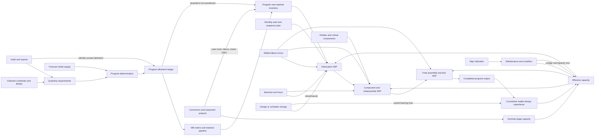
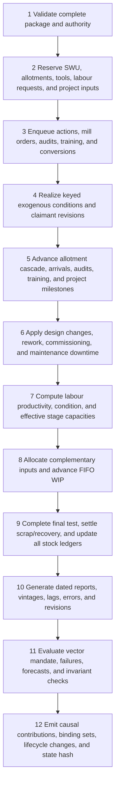

# Scenario design specification: Controlled Materials, 1943

| Field | Decision |
|---|---|
| Scenario ID | `controlled-materials-1943` |
| Design status | Implementation-ready proposal; **not historically, empirically, or educationally validated** |
| Fidelity | Historically grounded counterfactual with an analytically simplified production system |
| Player role | Composite WPB program-determination and allocations director |
| Clock | January–December 1943; 12 monthly turns |
| Runtime | Pure TypeScript scenario model plus declarative package metadata |
| Build verdict | **Go, high priority.** Build as the second materially different runtime model after The Narrows, once a small generic `ScenarioModel` adapter exists. |

## Design and build-priority verdict

This is a strong launch scenario because it makes a different system failure legible: allocating more scarce material and authorizing more starts can reduce completed output by swelling work in process (WIP), starving maintenance, disrupting learning, and moving the bottleneck to components, tools, or skilled labour. It also exercises reusable matrix allocation, multi-stage queues, capacity projects, learning, maintenance, revisions, causal traces, and vector objectives.

It is not a cheap content reskin. The current repository hard-codes Narrows-specific state, actions, objective IDs, units, and visibility types in `src/lib/sim/`; this scenario should trigger a narrow scenario-plugin boundary, not a universal DSL. Build order:

1. review this role and claim boundary with a US industrial-mobilization historian;
2. extract generic run/replay/branch/version envelopes around a `ScenarioModel<State, Decision, Visible>` adapter;
3. implement the controlled-material ledger, production queues, trace, and tests headlessly;
4. calibrate baselines before building polished views; and
5. conduct historian, operations-management, novice, and adversarial playtests before any “validated” label.

## One-sentence thesis

**When outputs require complementary inputs, the useful question is not “where should the next ton go?” but “which commitment will increase completed, serviceable output after delays without merely relocating the constraint into WIP, components, labour, tools, or degraded plant?”**

## Learning design and transfer

### Target dynamic intuitions

1. **Complementarity and endogenous bottlenecks.** A program’s realized flow is limited by its least available required input, but today’s allotments, starts, conversions, maintenance, and design changes determine which input binds later.
2. **Starts are not completions.** Releasing work faster than a downstream stage can process it increases WIP and cycle time; it can consume scarce material while final deliveries stagnate.
3. **Stability has option costs and benefits.** Repetition can improve labour productivity, while conversion and design changes can answer new needs at the cost of retooling, rework, learning loss, and schedule disruption.
4. **Slack is productive.** Contingency allotments, MRO, capacity headroom, and a controlled start rate can outperform nominal full utilization when supply, reports, and priorities change.

### Target misconceptions

- “Every scarce input should be allocated immediately.”
- “The program receiving the most material will deliver the most output.”
- “Starting more units is equivalent to producing more units.”
- “Ninety-nine percent utilization means the system is efficient.”
- “A plant conversion or labour transfer is instantaneous and additive.”
- “A priority rating guarantees completion.”
- “The CMP controlled every wartime resource.”
- “The historical output path proves one uniquely optimal allocation.”

### Intended decision pattern

The player should begin by protecting everything, encounter WIP and complementary-input limits, learn to reduce or sequence starts, preserve MRO, reserve a contingency pool, stabilize selected designs, and use audits early enough to reallocate before the quarter is lost. A good player does not eliminate bottlenecks; they anticipate and manage their migration.

### Evidence of transfer

After the AAR, give the player a short semiconductor-equipment problem with wafers, lithography hours, test capacity, technicians, maintenance, WIP, and a late product revision. Learning transfer is shown if the player:

- asks for completions and cycle time rather than starts alone;
- identifies complementary constraints;
- protects maintenance or headroom;
- distinguishes authorization from implementation; and
- explains why relieving one stage can expose another.

### Explicit non-learning goals

The scenario does not teach detailed aircraft, ship, vehicle, or munitions engineering; battlefield strategy; the ethics of wartime mobilization; labour history in full; price controls; macroeconomics; firm contracting; or a general theory of planning.

## Role contract

### Appointment

**Title:** Deputy Director for Program Determination and Controlled-Materials Allocations, War Production Board.

**Status:** Explicitly composite. It combines staff work performed around the Program Vice Chairman, Requirements Committee, controlled-material branches, and program-control offices. No single historical official possessed every modeled lever.

The WPB itself was established in January 1942 with broad authority over procurement policy, conversion, plant expansion, specifications, and construction; the chairman could delegate that authority ([Executive Order 9024](https://www.presidency.ucsb.edu/documents/executive-order-9024-establishing-the-war-production-board-the-executive-office-the)). The 2 November 1942 CMP defined the Program Vice Chairman as chair of the Requirements Committee and treated committee decisions as the Vice Chairman’s decisions ([WPB, *Controlled Materials Plan*](https://www.govinfo.gov/content/pkg/GOVPUB-P32_4800-c534fb99ebb59f73ff22c929b145edfe/pdf/GOVPUB-P32_4800-c534fb99ebb59f73ff22c929b145edfe.pdf), definitions 4 and 9).

### Formal modeled authority

The player may:

- reconcile forecast supply with claimant requirements;
- recommend and, under delegated authority, issue quarterly program determinations;
- allot controlled materials to claimant/program envelopes;
- reserve a contingency allotment;
- issue designated broad-program conditions where justified;
- approve recorded transfers and reclaim demonstrably unused allotments;
- direct controlled-material branches to review forms, shapes, mill schedules, conservation, and substitution;
- sponsor WPB conversion, expansion, component-scheduling, standardization, and audit work; and
- formally request manpower action from the War Manpower Commission.

### Authority the player does not have

The player cannot:

- command Army, Navy, Maritime Commission, or contractor shop-floor dispatch;
- move workers by fiat;
- make rubber part of CMP;
- conjure machine tools, components, factory floor space, or skilled trades;
- rewrite military requirements without claimant action;
- compel instant design adoption or perfect reporting;
- spend unlimited administrative attention; or
- see hidden true state during live play.

The War Manpower Commission, not the WPB allocations director, held central manpower-allocation, recruitment, training, and placement authority ([Executive Order 9139](https://www.presidency.ucsb.edu/documents/executive-order-9139-establishing-the-war-manpower-commission-the-executive-office-the)). Labour actions are therefore requests, negotiated priority, training, or retention measures with delay and uncertain realization.

### Information channels

- claimant-agency requirements and revised schedules;
- controlled-material branch supply forecasts and mill shipment reports;
- bills of materials and lead-time submissions;
- prime-contractor CMP applications;
- inventory, allotment, WIP, and past-due-order returns;
- WPB field-office and industry-division reports;
- WMC labour-market and plant-urgency reports;
- Rubber Director and component-scheduling reports; and
- commissioned audits and plant investigations.

### Resources and cadence

- One integrated decision package is committed each month.
- Quarterly program determinations follow the historical advance cycle.
- Each action claims a calibrated number of **staff-work units** (`SWU`), a transparent simulation resource rather than a historical headcount.
- Unfinished investigations and projects continue to claim implementation capacity.
- The run always reaches December unless a software invariant fails; mandate breaches remain visible rather than ending the lesson early.

### Mandate and red lines

1. meet minimum dated deliveries for the currently designated critical programs;
2. preserve essential civilian-system service floors;
3. do not issue unbacked controlled-material allotments beyond the declared policy margin;
4. prevent avoidable industrial-capacity collapse through maintenance neglect;
5. keep the allotment ledger auditable; and
6. leave a usable production system, not only a final-month surge.

### Exogenous or separately governed institutions

The President and Office of War Mobilization, military procurement services, Congress, War Manpower Commission, War Labor Board, Rubber Director, Petroleum Administration for War, price-control institutions, unions, firms, and battlefield commands are outside direct player control. Their relevant decisions enter through reports, acceptance delays, program revisions, or bounded events.

## Historical boundary, claims, and simplifications

### What the historical CMP actually did

The November 1942 plan sought to balance approved programs with available supply, then pass allotments vertically from the Requirements Committee to claimant agencies, prime consumers, and secondary consumers. Requirements were based where possible on bills of materials, production schedules, inventories, and lead factors. Allotments were accounts and authorizations, not physical output. The initial controlled materials were steel, copper, and aluminum; other materials continued under priorities or separate controls ([WPB 1942 CMP](https://www.govinfo.gov/content/pkg/GOVPUB-P32_4800-c534fb99ebb59f73ff22c929b145edfe/pdf/GOVPUB-P32_4800-c534fb99ebb59f73ff22c929b145edfe.pdf), summary and §§1–10).

The transition covered second-quarter 1943 deliveries and was to be fully effective by 1 July. Construction/facilities and maintenance, repair, and operating supplies (MRO) had separate provisions. Inventory control sought minimum inventories compatible with authorized schedules, while the original quarterly report excluded material in process ([WPB 1942 CMP](https://www.govinfo.gov/content/pkg/GOVPUB-P32_4800-c534fb99ebb59f73ff22c929b145edfe/pdf/GOVPUB-P32_4800-c534fb99ebb59f73ff22c929b145edfe.pdf), §§19, 21–23).

The Army’s official history describes CMP as a closed, vertically delegated system tied to approved end-product programs and lead times. It also records attrition from overstated requirements, schedule slippage, allotment hoarding, alternate supply, and nonmaterial constraints; machine tools had their own allocation history rather than being CMP material ([R. Elberton Smith, *The Army and Economic Mobilization*](https://www.govinfo.gov/content/pkg/GOVPUB-D114-PURL-gpo107793/pdf/GOVPUB-D114-PURL-gpo107793.pdf), chs. XXIV–XXV, especially pp. 564–66 and 567–96).

### Mechanism and simplification register

| Topic | Historical mechanism represented | Simulation simplification |
|---|---|---|
| Controlled materials | Carbon/alloy steel, copper, and aluminum in specified forms | Four aggregate categories: carbon steel, alloy steel, copper products, aluminum products |
| Allocation cycle | Quarterly requirements, program determination, allotment, reallotment, mill orders | Monthly turns with explicit quarterly gates and aggregate claimant/program envelopes |
| Delegation | WPB → claimant → prime → secondary consumer | One visible program ledger plus a modeled cascade delay/compliance factor |
| Programs | Claimant agencies and many internal programs | Five teaching programs; they are not asserted to match historical agency accounts |
| Bills of materials | Product bills, scrap/loss, lead factors, inventory | Versioned program/stage coefficient matrices |
| Priorities | Noncontrolled materials and fabricated items remained under ratings/other controls | Components, rubber, and tools use separate priority/allocation pipelines |
| Rubber | Governed through the Rubber Director, conservation, synthetic expansion, and R orders | One rubber-equivalent complement and one commissioning/report uncertainty |
| Machine tools | Separately allocated/scheduled; capacity category varied | Three tool-hour pools supporting production and conversion |
| Labour | WMC and firms, not the CMP director | Delayed coordination requests, training cohorts, retention, and donor losses |
| WIP | Present in industry but excluded from the original CMP inventory report | Explicit stage/cohort stocks to expose starts-versus-completions |
| Learning | Aircraft production experience motivated learning-curve analysis | Bounded labour-productivity learning by stable design family; rate is calibration TBD |
| Maintenance | CMP separately protected MRO materials | Explicit maintenance backlog and equipment availability |
| Geographic plant network | Thousands of heterogeneous establishments | Schematic plant/stage cells; no literal factory reconstruction |
| Output | Many models, specifications, and delivery definitions | Program-specific standard units that must never be added across programs |

Rubber must remain visibly outside CMP. The 1942 Rubber Survey led to a separate Office of the Rubber Director and a synthetic-rubber/conservation program ([Rubber Survey Committee report](https://www.govinfo.gov/content/pkg/GOVPUB-PR32_400-5ba5c11666f8237a0d7818f949cd87a7/pdf/GOVPUB-PR32_400-5ba5c11666f8237a0d7818f949cd87a7.pdf); [NARA administrative history](https://www.archives.gov/research/guide-fed-records/groups/220.html#220.5.7)).

### Included mechanisms

- controlled-material supply, allotment, delivery, inventory, transfer, and attrition;
- separate rubber and critical-component supply;
- multi-stage production, cohort WIP, and minimum processing delays;
- complementary-input flow constraints;
- machine-tool, skilled-labour, and plant-stage capacity;
- conversion and expansion projects;
- bounded learning by doing and partial transfer across design changes;
- MRO, deferred maintenance, equipment condition, and endogenous outages;
- standardization, substitution, scrap, and recoverable rework;
- implementation bandwidth;
- lagged, biased, and revised reports;
- quarterly reprogramming and contingency reserves; and
- exact causal and binding-constraint traces.

### Omitted mechanisms

- prices, wages, profit, taxes, finance, inflation, and household demand;
- detailed steel shapes, alloy chemistry, mill routing, geography, power, rail, and fuel;
- strikes, discrimination, coercion, safety, injury, gender, race, and migration dynamics;
- plant ownership, contract types, renegotiation, and legal appeals;
- detailed lend-lease, Canadian, and allied allocation;
- military effectiveness of delivered output;
- tactical battlefield choice;
- quality distributions beyond a compact rework/test mechanism; and
- an optimizer silently reallocating resources.

### Claims this scenario may make

- Within the declared model, complementary inputs, delay, WIP, learning, conversion, and maintenance can move the binding constraint.
- CMP historically used controlled-material accounting tied to programs, bills, schedules, lead times, and vertical allotment.
- Rubber, machine tools, components, and manpower required other institutions and controls.

### Claims this scenario must not make

- That its allocations show what the United States should or would have done.
- That simulated program output estimates historical counterfactual production.
- That CMP alone caused US wartime production success.
- That wartime direction is a general policy prescription.
- That labour was freely movable or that social costs can be omitted in reality.
- That learning follows one universal rate.
- That high modeled output is equivalent to military success or public welfare.

## Causal and dependency map



The principal loops are:

- **learning loop:** stable completion → experience → lower labour hours per unit → more feasible completion;
- **congestion loop:** excessive starts → WIP → longer queues and embedded scarce input → fewer downstream completions;
- **wear loop:** high run hours plus low MRO → maintenance backlog → lower availability → tighter capacity;
- **conversion loop:** capacity project → near-term resource withdrawal → delayed new capacity and ramp-up;
- **bottleneck migration:** relieving metal supply raises starts until components, tools, labour, maintenance, or final test binds.

## Model contract

### Sets and canonical units

- Programs $P$: `aircraft`, `ships`, `vehicles`, `munitions`, `essential-civilian`.
- Stages $S$: `fabrication`, `component-assembly`, `final-test`.
- CMP categories $M$: `carbon-steel`, `alloy-steel`, `copper-products`, `aluminum-products`.
- Non-CMP complements $N$: `rubber-equivalent`, `critical-components`.
- Tool pools $T$: `heavy-forming`, `precision-machining`, `test-and-finish`.
- Design families $C_p$: a small versioned set per program.
- Output/WIP unit: program-specific **standard program unit** (`SPU_p`); SPUs from different programs are never summed.
- Metals: short tons.
- Rubber/components: scenario-equivalent units, visibly labeled analytic.
- Labour/tool/maintenance: thousand hours per month.
- Capacity: `SPU_p/month`.
- Implementation: staff-work units (`SWU/month`).

### Minimum state

| ID | Kind | Unit | Live visibility | Source status | Cadence / reason |
|---|---|---:|---|---|---|
| `supply.metalForecast[m,month]` | forecast | short tons | reported range | sourced structure; calibrated quantity | monthly revision; supports allotment |
| `supply.metalRealized[m,month]` | flow | short tons/month | delayed/revised | calibrated | monthly; drives arrivals |
| `ledger.allotment[m,p,quarter]` | authorization stock | short tons | exact account | sourced mechanism | quarterly plus transfers |
| `ledger.reserve[m,quarter]` | authorization stock | short tons | exact account | sourced mechanism | quarterly contingency |
| `pipeline.metal[m,p]` | delayed queue | short tons by ETA | reported | derived | monthly mill-order cascade |
| `inventory.raw[m,p]` | physical stock | short tons | lagged estimate | derived/calibrated | monthly; feeds starts |
| `inventory.embedded[m,p,s,cohort]` | embedded stock | short tons | audit/debrief | analytic assumption | monthly conservation |
| `inventory.scrap[m,p]` | recoverable stock | short tons | lagged | analytic/calibrated | recovery delay |
| `supply.rubber[p]` | stock/pipeline | equiv. units | reported range | sourced separation; calibrated | monthly complement |
| `supply.components[p]` | stock/pipeline | component-equiv. | lagged | sourced mechanism; calibrated | monthly complement |
| `wip[p,s,cohort,design]` | queue stock | `SPU_p` | preliminary one-month lag | analytic | core starts/completions lesson |
| `schedule.starts[p]` | committed flow request | `SPU_p/month` | exact | player decision | monthly |
| `schedule.deliveries[p,month]` | target | `SPU_p/month` | exact/current vintage | calibrated/historical pattern | monthly mandate |
| `output.completed[p]` | flow | `SPU_p/month` | preliminary then revised | derived | headline outcome |
| `capacity.nominal[p,s]` | capacity | `SPU_p/month` | reported | calibrated | conversion target |
| `capacity.condition[p,s]` | slow state | fraction 0–1 | hidden; proxy/audit | analytic/calibrated | maintenance mechanism |
| `maintenance.backlog[p,s]` | stock | thousand hours | estimated range | analytic/calibrated | capacity degradation |
| `resources.tools[t,p]` | capacity allocation | thousand tool-hours/month | reported | sourced separation; calibrated | complementary input |
| `resources.labour[p,s]` | capacity | thousand skilled hours/month | lagged | sourced institution; calibrated | complementary input |
| `learning.experience[p,design]` | stock | cumulative `SPU_p` | model estimate | analytic; Wright-form candidate | learning |
| `learning.hoursPerUnit[p,s,design]` | derived | skilled hours/`SPU_p` | estimated range | calibrated | converts labour to capacity |
| `configuration[p]` | regime | design ID/stability age | exact | analytic | change/rework/learning |
| `projects[id]` | delayed project | stage/progress/resources | exact lifecycle | analytic/historical authority | conversion/expansion |
| `reports.dataQuality[k]` | latent | fraction 0–1 | proxy | assumed | lags/revisions |
| `implementation.committed` | capacity | SWU | exact | design-calibrated | prevents action spam |

### Transition equations

For each program and stage, requested stage flow is limited explicitly:

$$
q_{p,s,t}=\min\left(
r_{p,s,t},
W^{up}_{p,s,t},
K^{eff}_{p,s,t},
\frac{L_{p,s,t}}{h_{p,s,c,t}},
\frac{T_{p,s,t}}{\tau_{p,s,c}},
\min_j\frac{Z_{j,p,s,t}}{a_{j,p,s,c}}
\right).
$$

Terms that do not apply to a stage are omitted, not assigned an artificial infinity. The trace records every candidate limit, the minimum, all limits within the declared tie epsilon, and unused slack.

Effective capacity is:

$$
K^{eff}_{p,s,t}=K^{nom}_{p,s,t}\,A_{p,s,t}\,R_{p,s,t},
$$

where $A$ is equipment availability from maintenance and $R$ is commissioning/retooling readiness. Learning affects labour hours per unit, not material creation:

$$
h_{p,s,c,t}= \operatorname{clip}\left[
h^0_{p,s,c}
\left(\frac{\max(E_{p,c,t},E^{floor}_{p,c})}{E^{ref}_{p,c}}\right)^{-b_{p,s,c}},
h^{min}_{p,s,c},h^{max}_{p,s,c}
\right].
$$

All $b$, floors, bounds, and transfer coefficients remain calibration parameters. A design change creates a new design-family experience stock initialized by a declared fraction of predecessor experience; it never creates experience.

Maintenance is accounted in hours:

$$
B^{maint}_{p,s,t+1}=\max\left(0,
B^{maint}_{p,s,t}
\omega_{p,s}H^{run}_{p,s,t}
\rho_{p,s,t}
-H^{maintCompleted}_{p,s,t}\right).
$$

Availability is a bounded, monotone decreasing function of backlog, with any seeded outage draw keyed to prior condition and logged. Planned maintenance consumes MRO, maintenance labour, and downtime before it improves later availability.

WIP conservation is exact:

$$
W_{p,s,t+1}=W_{p,s,t}+q^{in}_{p,s,t}-q^{out}_{p,s,t}
-q^{scrap}_{p,s,t}-q^{reworkOut}_{p,s,t}+q^{reworkIn}_{p,s,t}.
$$

Each cohort has `startedTurn`, `earliestAdvanceTurn`, design, embedded-material ledger, remaining work, and status. No unit can start and complete in the same turn.

For every controlled material:

$$
\text{closing raw}=\text{opening raw}+\text{arrivals}+\text{recovered scrap}
-\text{embedded in new WIP}-\text{MRO use}-\text{project use}.
$$

Output removes the cohort’s embedded material from in-system inventory and records it in cumulative delivered material. Rework and scrapping move material only through declared recovery fractions and delays.

### Dispatch rules

- Within a program/stage, eligible cohorts advance FIFO unless the player commits an explicit sequence change.
- No hidden optimizer reassigns allotments, material, labour, tools, or components.
- An unused program allotment remains stranded until returned and formally transferred.
- Resource ties use stable program and cohort IDs; tie-breaking is versioned.
- Rounding occurs only at declared display boundaries; internal physical values remain finite nonnegative decimals.

## Monthly intra-step phase graph



Phase order is immutable within a scenario version. Current-turn maintenance downtime occurs before production; its condition benefit applies after completion. New arrivals may be used in phase 8. A project commissioned in phase 5 contributes only after its declared commissioning/ramp rule. Reports published in phase 10 cannot affect the already committed package.

## Action catalog

| Family | Player parameters | Direct commitment preview | Earliest effect / path | Reversibility and constraints |
|---|---|---|---|---|
| 1. Program determination and metal allotment | quarterly `m × p` allotments; reserve; designated conditions | debits forecast supply authority; reserves contingency; claims SWU | next quarter after claimant review and cascade | transfers require returned authority; aggregate cap enforced |
| 2. Production schedule and start control | starts by program; pauses; sequence; delivery emphasis | authorizes starts and communicates schedule; claims SWU on change | current/next month depending lock date; prime/secondary execution | late changes cause churn, rework, and learning disruption |
| 3. Plant conversion and capacity expansion | program/stage/donor; conversion or expansion; scale | reserves metal, tool hours, installation labour, downtime, SWU | multi-month project → commissioning → ramp | costly; donor capacity falls before recipient capacity rises |
| 4. Standardization, substitution, and recovery | design freeze; simplify; approved substitution; scrap drive | opens engineering/change-control work; changes future BOM or recovery pipeline | review and retool delay; then versioned design/BOM | can reduce demand but cause rework, quality risk, or learning transfer loss |
| 5. Machine-tool and component scheduling | tool shares; component priority; expedite/pool request | assigns scarce non-CMP capacity and claims expediting SWU | schedule now, deliveries normally delayed | cannot exceed pools; starving donor stages remains visible |
| 6. Skilled-labour coordination | WMC urgency request; training; retention; negotiated transfer | commits training/liaison SWU; identifies donor and recipient | request → acceptance → recruitment/training/transfer lag | realization is bounded; transfer reduces donor hours |
| 7. Maintenance and buffer policy | planned downtime; MRO shares; raw/component buffer targets | reserves MRO, maintenance labour, capacity time, and material | downtime now; availability and resilience later | deferred work accumulates backlog; buffers are not free output |
| 8. Audit, return, and redistribution | BOM audit; WIP census; inventory/allotment audit; bottleneck study | claims investigators/SWU; names scope and report date | report after lag; identified allotment can then be returned/transferred | information narrows named uncertainty only |

No action writes `output.completed`, `capacity.condition`, or an objective directly. Action validation returns errors, warnings, direct resource claims, lifecycle, lead-time window, and known first-order effects—not an omniscient output prediction.

## Observations and revisions

| Hidden or uncertain state | Normal player-visible proxy | Lag / error | Revision or information action |
|---|---|---|---|
| true metal supply | branch forecast range and mill shipments | current forecast; realized shipment lag | monthly branch revision |
| subcontractor metal inventory | program aggregate return | one month; omission/bias possible | targeted inventory/allotment audit |
| WIP by true stage/configuration | contractor progress return | one month; stage miscoding | WIP census; preserve original vintage |
| embedded materials in WIP | derived from reported WIP × current BOM | model estimate; wrong after design change | BOM plus WIP audit |
| true component availability | past-due order and delivery report | one month; incomplete lower tiers | component bottleneck study |
| skilled labour hours | WMC/contractor employment and absence report | one month; hours/productivity uncertain | labour-utilization investigation |
| tool availability | booked hours and outage return | current bookings; outage lag | plant investigation |
| condition/maintenance backlog | downtime, defect, speed-loss, maintenance completion | condition hidden; proxy noisy | maintenance audit |
| learning/productivity | realized direct hours per accepted unit | one month; mix-adjustment uncertainty | methods study |
| conversion readiness | milestone percentage and engineer narrative | optimism bias variant | on-site commissioning review |
| scrap recovery yield | collections and mill acceptance | one to two months | recovery audit |

Every report stores `eventTurn`, `asOfTurn`, `publishedTurn`, `status`, `revisesReportId`, source, methodology, confidence, and provenance. Charts retain the vintage the player saw; the debrief can overlay revised and true series. Hidden state with no decision relevance is not modeled.

## Stress events

### 1. Synthetic-rubber or tire-component commissioning variance

- **Window:** disclosed as a risk in January; resolves in February–April by keyed variant.
- **Mechanism:** changes future rubber-equivalent arrivals or the delivery lag, not existing stock.
- **Warning:** Rubber Director commissioning report and confidence band.
- **Purpose:** demonstrates that balancing CMP metals does not balance the whole product.
- **Mitigation:** buffers, component priority, substitution/standardization, or lower starts.

### 2. Claimant strategic reprogramming

- **Window:** one declared midyear and one late-year variant point; exact program pair is keyed.
- **Mechanism:** revises future delivery minima and design/configuration demand; it does not destroy resources.
- **Warning:** an earlier planning range identifies programs under review.
- **Purpose:** tests stability versus flexibility and the option value of reserves.
- **Mitigation:** contingency allotment, staged conversions, transferable designs, restrained WIP.

### 3. Condition-dependent critical-stage outage

- **Trigger:** maintenance backlog/condition crosses a declared risk band; keyed draw then determines occurrence and duration.
- **Mechanism:** removes effective stage hours and adds repair work.
- **Warning:** downtime and defect proxies worsen before the event.
- **Purpose:** makes maintenance causal rather than a final score tax.
- **Mitigation:** MRO protection, planned downtime, buffer, or alternate capacity.

The guided mode fixes event variants. Professional mode samples only declared alternatives. The outage is never unconditional punishment.

## Objective vector and failure conditions

| Priority | Objective | Measure | Hard? |
|---:|---|---|---|
| 1 | Preserve essential civilian systems | months below declared essential-service delivery floor | yes |
| 2 | Meet designated critical-program deliveries | dated completion shortfall by program, never summed across SPUs | yes |
| 3 | Keep allotments lawful and auditable | unauthorized tons, unreconciled transfers, ledger mismatch | yes |
| 4 | Preserve productive capacity | availability, unplanned outage months, end maintenance backlog | soft with breach band |
| 5 | Convert scarce inputs into completions | schedule attainment, WIP age, cycle time, stranded embedded material | soft |
| 6 | Preserve adaptability | reserve, usable capacity, component/raw coverage, project state at December | soft |

Failure states are mandate labels, not game-over shortcuts:

- `breached-essential-service`;
- `breached-critical-delivery`;
- `unbacked-allotment`;
- `industrial-capacity-emergency`;
- `implementation-gridlock`; and
- `ledger-or-conservation-failure` (software exception, not a gameplay outcome).

All gameplay thresholds are design/calibration parameters in the register, never historical welfare facts.

Process measures include forecast calibration, forecast direction, reaction lag, start-rate volatility, design/schedule churn, months at full SWU, maintenance deferral, WIP age, reserve use, audits early enough to matter, unused/stranded allotment, and correct bottleneck identification.

## Twelve-turn decision arc

| Turn | Historical-operational gate | Intended player problem |
|---:|---|---|
| 1 — Jan | Reconcile Q2 requirements; first bulk determinations due | learn BOM × schedule × lead time; choose reserve versus apparent demand |
| 2 — Feb | Cascade Q2 allotments to claimants/prime consumers | see that authorization and material arrival are different |
| 3 — Mar | Place transition-quarter mill orders; inspect inherited WIP | control starts before partial CMP operation |
| 4 — Apr | Q2 CMP transition begins; determine Q3 requirements | first full complementarity diagnosis |
| 5 — May | Cascade Q3 allotments; conversion projects mature | weigh near-term resource withdrawal against later capacity |
| 6 — Jun | Final readiness for full CMP; audit/return window | reclaim attrition without stripping useful buffers |
| 7 — Jul | CMP fully effective; determine Q4 | bottleneck migrates from metals toward components/tools/labour |
| 8 — Aug | Cascade Q4; reprogramming pressure | decide whether design/schedule change is worth learning and rework cost |
| 9 — Sep | Quarter-end redistribution and maintenance warning | protect capacity instead of chasing utilization |
| 10 — Oct | Q4 operation; frame Q1 1944 advance allotments | manage a more balanced system with localized shortages |
| 11 — Nov | Late program revision and advance commitments | use option value, not hindsight |
| 12 — Dec | Close ledgers; no “last-turn free maintenance” | complete, preserve, forecast the next quarter, and hand over |

Guided mode progressively discloses views, not ahistorically locks authority the role would already possess. Professional/Historical Desk mode exposes all action families from turn 1 with period-appropriate reports. Sandbox exposes truth only after an explicit setting and does not count for assessment.

## Interface and headline KPIs

### Pages

1. **Situation / Mandate:** vector guardrails, current report vintages, alerts, and three forecasts.
2. **Program Matrix:** programs × inputs showing authorized, arrived, embedded, required, slack, and current binding set.
3. **Flow and WIP:** stage funnels, cohort ages, start/completion history, and queue reconstruction.
4. **Factories:** schematic plant-stage cells with nominal/effective capacity, utilization, condition proxy, downtime, tools, and labour.
5. **Allotments:** quarterly source-to-claimant ledger, reserve, cascade status, transfers, attrition, and mill pipeline.
6. **Projects and Configuration:** conversion Gantt, design family, rework, commissioning, and learning estimate.
7. **Reports:** dated objects with preliminary/revised overlays and audit requests.
8. **Decision Book:** immutable packages, previews, forecasts, rationale, lifecycle, branch ancestry, and trace links.

### Maximum 12 headline KPIs

1. critical-program schedule attainment by program small multiples;
2. essential-civilian delivery versus floor;
3. starts versus completions;
4. total WIP and oldest-cohort age;
5. current and forecast binding constraint;
6. controlled-material allotment utilization/attrition;
7. raw and component coverage;
8. machine-tool utilization and queued demand;
9. skilled-labour coverage;
10. plant availability and maintenance-risk band;
11. configuration stability / learning trend; and
12. free implementation SWU and contingency reserve.

There is no aggregate “war production score.” Tooltips must state that program SPUs are incomparable. The factory map is a schematic dependency view, not a geographic reconstruction.

## Forecast prompts

Before each commit, professional mode requires:

1. “Which named input or stage will bind the selected critical program next month?”
2. “What range of completed `SPU_p` will that program report two months from now?”
3. “Will total WIP and oldest-cohort age rise, fall, or remain stable after this package, and why?”

At quarter gates replace prompt 3 with: “How much of this quarter’s controlled-material authority will remain unused or stranded?” Store point/range, confidence, rationale, report vintage, and scoring rule. Missing forecasts warn in the kernel; the player UI may require them.

## Causal trace contract

Every headline change emits structured `Contribution` records with:

- target ID and dimension keys;
- mechanism ID;
- source variable IDs;
- related action, event, project, report, and cohort IDs;
- signed amount and canonical unit;
- requested, available, realized, and slack values where constrained;
- complete `bindingSet`, not only one winner;
- observation visibility;
- arithmetic note; and
- parameter/version provenance.

Required trace targets:

- raw, embedded, scrap, and delivered controlled material;
- stage WIP in/out/rework/scrap;
- completed output;
- labour and tool hours;
- component and rubber consumption;
- nominal/effective capacity;
- learning-hour change;
- maintenance backlog, condition, downtime, and outage;
- allotment reserve, issue, return, transfer, use, and attrition;
- every objective and failure transition.

For a completion shortfall, the trace must answer:

1. what was requested;
2. what upstream eligible WIP existed;
3. every complementary-input ceiling;
4. which ceilings tied within epsilon;
5. what direct decision or inherited commitment created each ceiling; and
6. whether the player could have known it from then-available reports.

Live traces reveal operational facts already reportable and do not leak true hidden state. Full truth and parameter contributions unlock in AAR/sandbox. The trace explains model arithmetic, not real-world causation.

## After-action review, counterfactuals, and transfer

The AAR sequence is:

1. replay the player’s notes and forecasts without hidden truth;
2. reconstruct decisions, action lifecycles, reports, revisions, events, and projects;
3. show a program-by-month binding-constraint heatmap;
4. reconcile controlled-material authorization → arrival → raw stock → WIP → scrap → delivery;
5. compare starts, completions, WIP age, and cycle time;
6. show learning gains beside design/schedule changes and transferred experience assumptions;
7. show maintenance backlog → availability → outage contribution;
8. reveal hidden state and classify it as unknowable, knowable by audit, or visible-but-neglected;
9. compare baselines and nearby seeds;
10. branch from the most informative quarter gate; and
11. administer the transfer problem.

Default local counterfactuals:

- the same policy with starts capped at the downstream feasible rate;
- the same policy with maintenance protected one month earlier;
- the same policy with the contingency allotment held or released one month earlier;
- stable design versus the chosen design change;
- an early audit/redistribution branch; and
- identical decisions on nearby event variants.

Counterfactual language is always “under this model.” It never states what historically would have happened.

## Baseline policies

| Policy | Rule | Expected diagnostic use |
|---|---|---|
| `minimal` | preserve inherited shares, starts, and maintenance; no new projects/audits | exposes inherited imbalance and event sensitivity |
| `naive-material-maximizer` | allot all forecast metals; maximize starts toward largest schedule gap; minimal reserve/MRO | produces WIP, attrition, and migrating bottlenecks |
| `reactive-firefighter` | redirect after reported shortfall; expedite current binder; frequent conversions | exposes lag, churn, and overcorrection |
| `competent-flow` | quarter-ahead allocation; cap starts by downstream estimate; protect MRO/headroom; audit early; small reserve | should survive most ordinary seeds without dominating all trade-offs |
| `historically-inspired-CMP` | use quarterly bills/lead factors, vertical program accounts, advance allotments, returns, and separate non-CMP priorities | institutional comparison, not “historically optimal” |
| `adversary` | search action boundaries for last-turn maintenance dumping, transfer loops, WIP hiding, tie/rounding, and project spam | exploit regression |

Baselines are scripted test fixtures, never presented as intelligent substitutes or optimal policy.

## Invariants and automated tests

### Software and accounting invariants

- deterministic initialization, step, replay, branch, and serialization;
- pinned engine, scenario, model-plugin, content, RNG, and parameter-set versions;
- no `Math.random`, clock, network, browser, React, or LLM in the model;
- finite values and stable canonical hashes;
- all physical stocks, WIP, capacity, and hours nonnegative;
- controlled-material conservation including embedded cohort material and recovered scrap;
- WIP cohort and stage-flow conservation;
- no completion before minimum stage delays;
- no cohort in two stages at once;
- allotment issue/return/transfer/use ledger reconciliation;
- aggregate authorization within the configured supply/over-allotment policy;
- no unlogged resource reassignment;
- project progress only when declared inputs and predecessors are satisfied;
- donor capacity removed when conversion begins;
- design change cannot create WIP, material, capacity, or experience;
- stable-design experience cannot decrease except through an explicit model-versioned rule;
- maintenance completion cannot exceed MRO, labour, or scheduled downtime;
- objective values remain in declared bounds;
- observation reports obey as-of/publication/revision rules;
- guided events and state triggers fire exactly as declared; and
- all headline KPI deltas and objective transitions have complete trace coverage.

### Required test suite

- initialization snapshot and initial ledger;
- all-action validation, authority, mutual exclusion, and lifecycle;
- each stock/flow identity in isolation;
- complementary-input tie and deterministic tie-break tests;
- WIP delay, FIFO, rework, and design-version tests;
- learning-transfer bounds;
- maintenance degradation/recovery/outage tests;
- project dependency and cancellation tests;
- quarterly allotment and advance-commitment tests;
- report lag, error, audit, and revision vintage tests;
- event warning/trigger/mitigation tests;
- save/load and branch equivalence;
- baseline regressions;
- extreme zero/high capacity and zero-input cases;
- causal-trace completeness; and
- at least 100 seeds per release candidate.

### 100-seed acceptance expectations

These are design QA targets, not historical estimates:

- 100/100 seeds pass replay, serialization, finiteness, conservation, and trace invariants.
- The competent-flow baseline avoids hard mandate breaches on a preregistered large majority of ordinary seeds; set the exact target before balance tuning.
- Minimal and naive policies perform materially worse on at least one hard or process measure over the seed distribution.
- Naive maximum-start policy has higher WIP age and no better median completion reliability than competent-flow.
- At least two distinct binding categories appear during a typical run; otherwise the scenario has failed to teach migration.
- No policy weakly dominates every other baseline on every mandate dimension across the seed set.
- Mitigating an event’s modeled precursor improves its affected distribution without guaranteeing immunity.
- Event frequencies exactly match declared keyed variants, and adding a new RNG purpose does not shift existing draws.

## Parameterization and calibration plan

No detailed numerical parameter is approved by this document. The package must ship a register with:

`id, dimensions, unit, value_or_distribution, minimum, maximum, provenance_tag, source_link/page, derivation, uncertainty, sensitivity_priority, scenario_version, parameter_set, notes`.

Allowed provenance tags are `sourced`, `derived`, `calibrated`, `assumed-analytic`, and `fictional-interface`. Never collapse them into “historical.”

### Calibration sequence

1. Define each `SPU_p` and its output series; keep programs incomparable.
2. Derive BOM/lead-time candidate ranges from period program records or published official studies.
3. Reconcile metal-supply and shipment series to the four modeled categories.
4. Fit only broad monthly/quarterly production patterns, not every historical point.
5. Estimate stage durations and WIP from plant/program studies where accessible; otherwise mark assumed and sensitivity-high.
6. Use Wright’s learning form only as a candidate functional shape; estimate program-specific rates or retain wide alternatives.
7. Calibrate maintenance degradation and outage risk to engineering/SME plausibility, not to make neglect theatrically punitive.
8. Calibrate action/SWU delays from documented administrative sequences and playtest legibility.
9. Tune event variants and initial slack so at least two bottleneck migrations are possible but none is forced.
10. Freeze parameter sets before comparing policies; retain out-of-sample historical patterns for validation.

Historical pattern targets include: the April–July CMP transition; quarterly allocation and vertical cascade; attrition/returns; easing of broad controlled-metal limitation followed by localized component, tool, or manpower limits; and advance commitments. The WPB reported that by second-quarter 1944 broad output was no longer limited mainly by steel, copper, and aluminum, while components and manpower remained important—useful as an out-of-horizon directional check, not a 1943 calibration target ([WPB, *War Production in 1944*](https://www.govinfo.gov/content/pkg/GOVPUB-P32_4800-9e92e30522a253276362395c30ab5450/pdf/GOVPUB-P32_4800-9e92e30522a253276362395c30ab5450.pdf), pp. 14–21 and 74–85).

Required alternative parameter sets:

- weak versus strong learning;
- high versus low learning transfer after design change;
- slow versus fast maintenance degradation;
- low versus high allotment attrition;
- rigid versus responsive claimant execution;
- component scarcity versus skilled-labour scarcity; and
- low versus high conversion disruption.

High-sensitivity parameters must appear in the model card and AAR sensitivity view.

## Exploits and misleading lessons

| Risk | Countermeasure |
|---|---|
| Allot everything, then reclaim without cost | cascade delay, return audit, stranded authority, SWU, and transfer timing |
| Start units on turn 12 to game “activity” | objectives count completions, WIP age, embedded material, and handover state |
| Defer all final-turn maintenance | end backlog/availability objective and four-month epilogue projection |
| Spam conversions | donor loss, resources, project queue, commissioning, ramp, and SWU |
| Churn designs to obtain better BOMs | retooling, rework, partial learning transfer, approval delay |
| Hoard reserve forever | missed critical deliveries and unused-allotment process measure |
| Treat reserve as waste | compare event resilience and local counterfactuals |
| Infer one material ton is substitutable across forms/programs | distinct metal categories and versioned BOMs |
| Treat priorities as physical supply | separate authorization, order, delivery, inventory, and production states |
| Read a single “binding constraint” when limits tie | binding sets and full slack matrix |
| Sum incomparable program output | UI/type lint forbids cross-program SPU totals |
| Assume CMP controlled rubber/labour/tools | separate ledgers, institutions, labels, and model-card warning |
| Learn that coercive wartime allocation is generally desirable | ethical/claim boundary and transfer discussion |
| Optimize against fixed scripted shocks | professional variant sets, nearby-seed AAR, no secret event deck |
| Mistake calibrated learning for history | alternative rates and explicit analytic provenance |

Adversarial review must also test rounding arbitrage, duplicate action IDs, negative transfers, cancellation refunds, stale-report leakage, audit omniscience, cohort relabeling, and near-tie instability.

## Model-card requirements

The release model card must disclose:

- composite authority and institutional compression;
- the three actual CMP metals and separate treatment of rubber, tools, components, and labour;
- aggregate programs and synthetic SPUs;
- WIP/learning/maintenance equations as analytic teaching mechanisms;
- all high-sensitivity assumptions and alternative parameter sets;
- event construction and seed ranges;
- observation errors and report vintages;
- declared omissions, especially labour coercion, inequality, safety, and civilian welfare;
- that output is not military effectiveness;
- that causal traces explain only model arithmetic;
- validation status across software, model, game, and learning validity; and
- prohibition on operational planning, historical proof, employee assessment, or public-policy prediction.

Ethical review should specifically check whether the scenario turns people into a frictionless resource, romanticizes mobilization, hides civilian burdens, rewards unsafe utilization, or implies that administrative legibility equals social legitimacy.

## Runtime and package compatibility

The shipped Narrows package is currently a metadata skeleton; its TypeScript implementation remains authoritative. This scenario should preserve:

- pure deterministic `initialize`, `validateDecision`, `step`, and visibility projection;
- version-pinned event-sourced `SimulationRun`;
- immutable `TurnRecord` decisions, reports, events, action changes, objectives, traces, bindings, invariants, hash, and snapshot;
- exact replay and branch semantics;
- hidden truth separated from `VisibleSnapshot`; and
- local-first operation.

Required narrow refactor before implementation:

- parameterize run envelopes by scenario state/decision/visible types;
- replace Narrows-only action, objective, constraint, event, report-kind, and unit unions with scenario catalogs or generic IDs validated by the model;
- keep money/ledger support optional; this scenario needs allotment and physical ledgers, not finance;
- add generic cohort queue, capacity project, and matrix trace helpers only where both scenarios benefit;
- let each scenario declare its immutable phase graph; and
- route UI pages through package view definitions plus scenario-specific typed widgets.

Proposed package:

```text
scenarios/controlled-materials-1943/
  manifest.json
  briefing.md
  entities.json
  variables.json
  actions.json
  observations.json
  events.json
  objectives.json
  views.json
  debrief.json
  parameter-register.csv
  sources.json
  model-card.md
  model/
    index.ts
    parameters.ts
    trace.ts
  tests/
    invariants.test.ts
    replay.test.ts
    baselines.test.ts
    observations.test.ts
    sensitivity.test.ts
```

`manifest.json` declares `stepUnit: month`, `turns: 12`, the 12 phases above, model/content/RNG versions, and modes:

- `guided`: analytic tutorial, fixed variants, progressive view disclosure;
- `professional`: Historical Desk information and all authority available;
- `sandbox`: post-run truth, parameter variants, and no assessment claim.

The model plugin has no React, browser, network, filesystem, wall-clock, ambient RNG, or LLM dependency. LLM prose may summarize only logged visible state or AAR trace and never adjudicate outcomes.

## Validation program

### Model validity

- reconcile all ledgers and stage identities;
- reproduce selected quarterly timing and qualitative bottleneck patterns;
- review BOM, lead-time, learning, conversion, and maintenance ranges with domain experts;
- test directional interventions one at a time;
- publish alternative parameterizations where evidence is weak; and
- never infer validation from a plausible historical-looking chart.

### Game validity

- novice can distinguish allotment, order, arrival, start, WIP, and completion;
- reasonable hedging is not punished by secret designer knowledge;
- failures are explainable from reports plus post-run trace;
- no action family or fixed share dominates;
- no more than 12 headline KPIs appear at once; and
- the role’s indirect labour/rubber/claimant authority remains legible.

### Learning validity

- pre/post probes on complementarity, WIP, bottleneck migration, maintenance, and authorization versus flow;
- coded transfer-task rubric;
- forecast improvement on replay;
- reduction in oscillatory starts/reallocations;
- improved binding-set identification; and
- interviews checking for the misleading lessons listed above.

## Source register and access statement

### Primary and contemporaneous official sources — full text accessed

- **War Production Board, *Controlled Materials Plan*, 2 November 1942.** Full 64-page GovInfo PDF was downloaded and text-inspected for definitions, claimant structure, quarterly requirements/allotments, bills of materials, lead times, vertical reallotment, inventories, MRO, construction, and transition. [Stable GovInfo PDF](https://www.govinfo.gov/content/pkg/GOVPUB-P32_4800-c534fb99ebb59f73ff22c929b145edfe/pdf/GOVPUB-P32_4800-c534fb99ebb59f73ff22c929b145edfe.pdf).
- **War Production Board, *War Production in 1944*.** Full 156-page GovInfo PDF was downloaded and text-inspected for CMP operation, attrition, advance allotments, administrative simplification, maintenance reserves, and migration from broad metal shortage toward components/manpower. [Stable GovInfo PDF](https://www.govinfo.gov/content/pkg/GOVPUB-P32_4800-9e92e30522a253276362395c30ab5450/pdf/GOVPUB-P32_4800-9e92e30522a253276362395c30ab5450.pdf).
- **Franklin D. Roosevelt, Executive Order 9024, 16 January 1942.** Full transcription accessed; supports WPB authority and delegation. [American Presidency Project](https://www.presidency.ucsb.edu/documents/executive-order-9024-establishing-the-war-production-board-the-executive-office-the).
- **Franklin D. Roosevelt, Executive Order 9139, 18 April 1942.** Full transcription accessed; supports the separate WMC authority boundary. [American Presidency Project](https://www.presidency.ucsb.edu/documents/executive-order-9139-establishing-the-war-manpower-commission-the-executive-office-the).
- **Rubber Survey Committee, *Report*, 1942.** Searchable official GovInfo PDF accessed for the separate rubber program and its dependence on critical materials; no numerical scenario parameter is taken from it yet. [Stable GovInfo PDF](https://www.govinfo.gov/content/pkg/GOVPUB-PR32_400-5ba5c11666f8237a0d7818f949cd87a7/pdf/GOVPUB-PR32_400-5ba5c11666f8237a0d7818f949cd87a7.pdf).

### Official historical scholarship — full text accessed

- **R. Elberton Smith, *The Army and Economic Mobilization* (US Army Center of Military History, 1959).** Full 776-page official history was downloaded and text-inspected, especially chapters XXIV–XXVI. It supports machine-tool allocation, CMP design/operation, vertical control, bills, lead times, attrition, program changes, and noncontrolled component bottlenecks. [Stable GovInfo PDF](https://www.govinfo.gov/content/pkg/GOVPUB-D114-PURL-gpo107793/pdf/GOVPUB-D114-PURL-gpo107793.pdf).
- **National Archives, Record Group 179, Records of the WPB.** Full finding-aid page accessed; corroborates institutional dates and surviving Requirements Committee/CMP records. [NARA finding aid](https://www.archives.gov/research/guide-fed-records/groups/179.html).
- **National Archives, Record Group 211, Records of the WMC.** Full finding-aid page accessed; corroborates separate manpower institutions. [NARA finding aid](https://www.archives.gov/research/guide-fed-records/groups/211.html).

### Quantitative calibration sources — identified, not yet extracted

- **Army Air Forces, *Statistical Digest: World War II*.** Official full PDF is accessible; tables have not yet been converted into scenario parameters. [Department of Defense PDF](https://media.defense.gov/2011/Mar/31/2001330134/-1/-1/0/AFD-110331-045.pdf).
- **US Census Bureau, *War Production Indexes: U.S. Production of Selected Combat Items*.** Publication landing page accessed; series extraction and definition checks remain future calibration work. [Census historical publication](https://www.census.gov/library/publications/1940/dec/war-production-indexes-1940-1945.html).

### Analytical scholarship — structural use only

- **T. P. Wright, “Factors Affecting the Cost of Airplanes” (1936).** Publisher DOI metadata and an accessible full-text scan were identified. It motivates a candidate cumulative-production learning form; this design takes no universal learning rate from the paper. [DOI](https://doi.org/10.2514/8.155).
- **John D. C. Little, “A Proof for the Queuing Formula: $L=\lambda W$” (1961).** Publisher abstract/metadata accessed, not the full article. It supports the general WIP–throughput–flow-time relationship, not a historical claim about 1943 plants. [INFORMS DOI page](https://pubsonline.informs.org/doi/abs/10.1287/opre.9.3.383).

### Local design and implementation sources — full access

- User-provided `serious-systems-simulation-engine-spec.md`, especially §§15, 17.3, 18, 19 and Appendices A–B.
- Repository `CLAUDE.md`, `docs/architecture.md`, `docs/model-card.md`, `src/lib/sim/`, and `scenarios/narrows/`.

### Source-status rule

Major historical facts in this specification rest on full-text primary or official historical sources. Candidate quantitative sources remain “identified, not extracted.” All WIP, learning, maintenance, SPU, observation-error, event-distribution, and objective-threshold parameters remain `calibrated` or `assumed-analytic` until a register supplies inspectable evidence and derivation.

## Unresolved risks and review gates

1. **Role compression:** historian review must confirm that the composite role is candid and that each action uses plausible delegation or coordination.
2. **Program aggregation:** five SPUs may conceal decisive within-program component and design differences.
3. **WIP evidence:** aggregate wartime WIP data may be unavailable; the queue model could be pedagogically sound yet weakly historical.
4. **Learning identification:** observed productivity gains confound learning, scale, capital, design, and selection; retain alternative forms.
5. **Maintenance calibration:** poor evidence could make the wear loop feel moralizing or gamey.
6. **Labour ethics and realism:** an hours pool risks erasing worker agency, discrimination, hazards, bargaining, turnover, and geography.
7. **Civilian floor:** any threshold is a design guardrail, not a welfare estimate.
8. **Monthly step size:** it may hide within-month sequencing; cohort delays and phase tests must prevent order artifacts.
9. **Matrix overload:** the UI must progressively disclose detail without hiding complementary inputs.
10. **False precision:** do not implement until SPUs, BOM units, lead times, and source statuses are explicit.
11. **Engine refactor risk:** generic IDs must not weaken Narrows type safety or replay compatibility.
12. **Validation gap:** software verification is achievable; historical validity, game validity, and learning transfer require separate human review.

Release gates are: source/role review, unit-complete parameter register, invariant-clean headless model, 100-seed baseline report, exploit review, model card, accessibility review, historian/operations SME playtest, novice learning pilot, and explicit candidate—not validated—release labeling.
