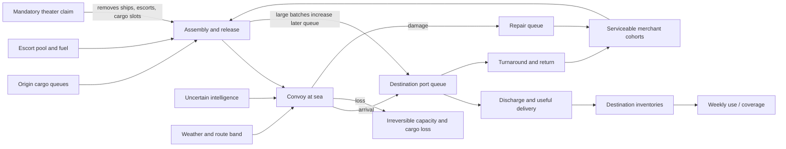

# North Atlantic, 1942: The Throughput Ledger

**Status:** Implementation-ready design specification; not implemented, calibrated, or validated  
**Scenario ID:** `north-atlantic-1942`  
**Package version target:** `0.1.0`  
**Historical window:** 6 July 1942–3 January 1943, 26 weekly turns  
**Role:** Secretary, Combined North Atlantic Shipping Coordination Staff (explicitly composite)  
**Fidelity:** Historically grounded logistics counterfactual, not a tactical naval simulation  
**Primary engine test:** moving entities, schedules, network cycles, keyed hazards, congestion, and repair

## 1. Design verdict

Build this after Controlled Materials and the scenario-loader/runtime split, as the
next materially different network model rather than by coercing it into *The Narrows*
types.

It is a strong scenario because the apparent goal—reduce merchant losses—is not the
actual system objective. The player must sustain useful delivery while ships spend
time assembling, crossing, queuing, discharging, returning, and being repaired.
More protection can reduce loss while lengthening cycles; larger convoys can reduce
encounter exposure while creating assembly delay and port surges. These mechanisms
are evidenced in the official British merchant-shipping history, which treats time
in port, convoy waiting, route distance, repair immobilization, and cargo stowage as
parts of carrying capacity, not side issues
([Behrens, full PDF](https://www.generalstaff.org/WW2/Hist_UK/MerchantShippingDemandsWar.pdf)).

Do not implement this scenario until:

1. scenario-owned state, decision, visible-state, event, report, and objective types
   can plug into a generic run envelope;
2. stable moving-entity IDs can key deterministic hazards;
3. the UI receives only a scenario-defined visible projection; and
4. the parameter register can distinguish sourced, derived, calibrated, assumed,
   and fictional values.

The scenario must not claim to reproduce the Battle of the Atlantic or determine
what a historical alternative “would have” caused. It exposes consequences inside a
declared, reviewable model.

## 2. Learning contract

### 2.1 Decision failure

The novice optimizes the most vivid number—ships sunk this week—and unintentionally
starves destination inventories by holding sailings, over-concentrating escorts,
ignoring repair, or releasing cargo in port-clogging batches.

### 2.2 Thesis

Useful maritime throughput is governed jointly by irreversible loss, the full ship
cycle, batch congestion, cargo mix, and destination stocks:

$$
\text{useful delivery rate}
\approx
\frac{\text{usable carrying capacity}}
{\text{assembly}+\text{passage}+\text{port}+\text{return}+\text{repair time}}
\times \text{cargo usefulness}.
$$

This is a causal mnemonic, not an accounting equality. The simulation computes
cohort and convoy flows directly.

### 2.3 Transfer goals

After the AAR, the player should be able to:

- distinguish stock protection from flow and cycle-time management;
- identify a bottleneck that migrates from escorts to ports, repair, or cargo mix;
- explain why an action that reduced losses could still reduce useful delivery;
- ask for information with a date, uncertainty, and revision status; and
- transfer the same reasoning to hospital beds, vehicle fleets, containers, or
  maintenance-intensive infrastructure.

### 2.4 Misconceptions the design must resist

- “The largest possible convoy is always optimal.”
- “Every merchant ton and every cargo ton is fungible.”
- “A weekly loss count measures the health of the transport system.”
- “Intelligence is a precise map of enemy positions.”
- “The player controls naval tactics and national shipping authorities.”
- “A model-generated branch proves historical causation.”

## 3. Role, authority, and information set

The player is the **Secretary, Combined North Atlantic Shipping Coordination Staff**,
a fictional composite staff post. It is inspired by the Combined Shipping Adjustment
Board, the British Ministry of War Transport, the US War Shipping Administration,
naval control authorities, and Canadian/port representatives.

The composite is necessary because no single historical official held every lever in
the game. The January 1942 Allied agreement describes coordination and adjustment
while execution remained with national authorities
([FRUS document](https://history.state.gov/historicaldocuments/frus1941-43/d210)).
The US War Shipping Administration separately controlled the operation and use of US
ocean shipping
([Executive Order 9054](https://www.presidency.ucsb.edu/documents/executive-order-9054-establishing-war-shipping-administration-the-executive-office-the)).

### 3.1 The player may

- recommend release cadence and convoy grouping for the delegated Atlantic pool;
- allocate delegated merchant cohorts and cargo priorities between services;
- recommend escort distribution and readiness windows at an operational level;
- choose route/weather posture from naval-control options;
- schedule delegated port, repair, and temporary handling effort;
- request targeted intelligence or coordination reports; and
- accept, defer, or renegotiate soft claims where the event contract permits it.

### 3.2 The player may not

- direct destroyers in combat, hunt submarines, or set tactical formations;
- command submarine, air, codebreaking, shipyard, or national shipping policy;
- cancel mandatory theater commitments unilaterally;
- create merchant hulls, escorts, fuel, or port capacity instantly;
- know latent route threat, exact damage, or future weather; or
- alter a manifest or allocation after its convoy has sailed.

National bodies and commanders implement recommendations through explicit delays and
may return partial realization when a resource, authority, or timing constraint
binds. No off-screen actor silently “optimizes” unused resources for the player.

## 4. Scope and non-goals

### 4.1 Included network

- North American origin/assembly nodes: New York group and Halifax/Sydney group;
- eastbound fast (`HX`) and slow (`SC`) service abstractions;
- westbound return/reposition legs (`ON`/`ONS`) inside each ship's cycle;
- North Atlantic route bands rather than tactical coordinates;
- UK west/north port groups, inland release, and destination inventories;
- merchant cohorts by speed, capacity, and condition;
- an escort pool, escort fuel, maintenance, and scheduled commitments;
- cargo queues for food, petroleum, and industrial/military dry cargo;
- damage, repair queues, serviceability, port handling, and weather;
- a fixed external-theater commitment representing the 1942 North African operation.

The convoy naming is historically legible, but the model uses cohorts and generated
convoy IDs, not a reenactment of individual ships. ConvoyWeb's Arnold Hague database
provides convoy-level movements suitable for calibration
([database](https://www.convoyweb.org.uk/)); individual records such as
[HX 194](https://www.convoyweb.org.uk/hx/hx.php?convoy=194%21) illustrate the data
shape but are not themselves calibration targets.

### 4.2 Excluded

- tactical antisubmarine warfare, weapons, kill probabilities, and submarine units;
- aircraft search patterns, codebreaking mechanics, or player cryptanalysis;
- named merchant crews, casualties, rescue, or morale as numeric resources;
- global shipping outside the delegated claims and exogenous return flows;
- detailed rail, warehouse, and civilian rationing models;
- ship construction inside the 26-week horizon;
- political bargaining as a free-form dialogue adjudicated by an LLM; and
- exact recreation of historical convoy membership or losses.

### 4.3 Ethical boundary

Merchant crews were civilians exposed to lethal danger; their service must not be
reduced to a celebratory score loop
([Imperial War Museums overview](https://www.iwm.org.uk/history/a-short-history-of-the-merchant-navy);
[Canadian official overview](https://www.canada.ca/en/navy/corporate/history-heritage/battle-atlantic/merchant-navy.html)).
The UI uses restrained language—“lost,” “damaged,” “overdue”—and never awards kills.
The model tracks lost carrying capacity, not invented casualty estimates. The model
card must state that omitting casualties prevents false precision; it does not imply
that losses were merely material.

## 5. Causal model and accounting boundary



### 5.1 Authoritative ledgers

Every `kLT` of cargo is in exactly one of:

`originQueue`, `reserved`, `atSea`, `portQueue`, `delivered`, `consumed`,
`lost`, or `externallyTransferred`.

Every merchant ship and its `kDWT` capacity are in exactly one of:

`available`, `assembling`, `atSeaEast`, `portTurnaround`, `atSeaWest`,
`repair`, `externalClaim`, or `lost`.

Every escort hull is in exactly one of:

`available`, `assigned`, `atSea`, `maintenance`, `externalClaim`, or `lost`.

Transitions, not derived headline totals, are authoritative. Cargo and capacity
cohorts retain stable IDs across transitions. Do not infer deadweight from gross
registered tonnage through an assumed universal conversion.

### 5.2 Convoy risk

Risk is two-stage and convoy-keyed:

1. **Encounter:** latent route threat, time in band, intelligence/routing posture,
   weather, and convoy count determine whether an encounter occurs.
2. **Conditional severity:** effective escorts, merchant speed dispersion,
   cohesion, weather, and convoy composition determine damage/loss conditional on
   an encounter.

The random stream key is
`scenarioSeed/convoyId/mechanism/phaseIndex`, never array order or UI timing.
Ships in one convoy do not receive independent identical loss draws. Any convoy-size
effect must be a named, sensitivity-tested parameterization; the familiar operational
research argument for larger convoys is not licensed as “larger is always safer.”

### 5.3 Cycle time

For each returned or lost merchant cohort:

`cycleAge = assemblyWait + eastPassage + destinationQueue + discharge +
westReturn + repairDelay`.

The cohort ledger permits decomposition without double counting. A ship that remains
in repair at scenario end contributes censored repair time and unavailable capacity,
not a fabricated completed cycle.

## 6. Minimal state contract

Provenance tags are `[S]` sourced, `[D]` derived, `[C]` calibrated, `[A]` assumed,
and `[F]` fictional analytic content. Exact initial values remain `TBD` until the
calibration gate.

| State | Unit | True-state cadence | Player visibility | Provenance |
|---|---:|---|---|---|
| `cargo.origin[class,node]` | kLT | weekly | current ledger | C/D |
| `cargo.reserved[convoy,class]` | kLT | commitment/event | current after commit | D |
| `cargo.atSea[convoy,class]` | kLT | weekly | manifest plus dated status | D |
| `cargo.portQueue[port,class,age]` | kLT | weekly | lagged, revisable return | C/D |
| `inventory.destination[class]` | kLT | weekly | lagged stock return | C/D |
| `inventory.useRate[class]` | kLT/week | weekly/event | estimate and revisions | C/A |
| `merchantCohort[id]` count/capacity | ships, kDWT | weekly/event | status; condition partial | C/D |
| `convoy[id]` schedule/manifest/route | dates, IDs, kLT | weekly | orders and dated position window | D |
| `escortPool[node,status]` | hulls, escort-days | weekly | lagged readiness report | C/D |
| `escortFuel[node]` | kLT | weekly | current accounting estimate | C/A |
| `port.effectiveHandling[port]` | kLT/week | weekly/event | reported range | C |
| `port.queueAge[port]` | ship-weeks | weekly | lagged/revised | D |
| `repairQueue[class,age]` | ship-weeks, kDWT | weekly | initial estimate; revisable | C/D |
| `yardCapacity[port]` | ship-weeks/week | weekly/event | reported range | C |
| `maintenanceDebt[assetClass]` | ship-weeks | weekly | hidden; defect proxy | A/C |
| `routeThreat[band]` | latent index | weekly | hidden; intelligence distribution | C |
| `weather[band]` | category/sea-state index | weekly | forecast then observed | C |
| `staffCapacity` | staff-team-weeks | weekly | current | A |
| cumulative flow ledger | kLT, kDWT | transition | visible subject to report lag | D |
| objective state and breaches | typed | weekly | visible when evidence supports it | D |

Only state supporting an action, observation, identity, event, objective, or causal
trace belongs in version 0.1. Port labor subtypes, individual cargo holds, weapons,
and named personnel do not.

## 7. Weekly phase graph

The pure model executes the following order. A decision package is validated against
the start-of-turn visible snapshot; failure returns typed validation errors and
changes no state.

1. **Activate:** advance previously committed action lifecycles and publish reports due.
2. **Settle orders:** apply announced external claims, returns, and event realizations.
3. **Reserve:** reserve merchant, cargo, escort, fuel, yard, port, and staff commitments.
4. **Assemble/release:** form eligible convoys; hold incomplete groups under the declared rule.
5. **Progress transit:** advance stable convoy entities through route bands.
6. **Resolve hazards:** draw encounter, severity, damage, loss, delay, and diversion by keyed stream.
7. **Receive:** move arrivals to port queues in declared priority/FIFO order.
8. **Handle:** discharge cargo and start turnaround within effective port capacity.
9. **Use:** transfer useful deliveries to destination inventory, then apply weekly consumption.
10. **Return:** progress westbound/repositioning legs and release completed cohorts.
11. **Repair/maintain:** allocate yard capacity, age queues, reveal defects, and return serviceable assets.
12. **Observe:** generate dated reports, uncertainty intervals, and explicit revisions.
13. **Evaluate:** update objective vector, binding records, causal contributions, and invariants.

Within a phase, stable IDs determine order. A newly arrived ship cannot also complete
discharge and westbound return in the same weekly step unless a sourced duration and
fractional-flow rule explicitly permits it. Unused allocations remain unused.

## 8. Action contract

There are eight primary families. A package may contain multiple compatible actions,
but commits atomically. `TBD` quantities are parameterized, not invented during play.

| Family | Player choice | Direct commitment shown before commit | Earliest effect / lifecycle | Principal constraints |
|---|---|---|---|---|
| 1. Service schedule | target departure week, cadence, size band, release rule | reserved ship slots, cargo slots, staff; expected assembly window | next eligible sailing; proposed → approved → implementing → completed/superseded | ship/cargo availability, minimum viable escort, port forecast |
| 2. Merchant allocation | assign speed/condition cohorts to HX, SC, return, reserve, or external claim | ships and kDWT by cohort; reassignment cost | next unsailed service; in-force policy until superseded | immutable sailed assignments, speed compatibility, national claim |
| 3. Escort/readiness allocation | distribute escort-days and maintenance windows between services | hulls, escort-days, fuel, deferred maintenance | next available escort cycle; multiweek claim | location, turnaround, serviceability, mandatory detachments |
| 4. Route/weather posture | choose offered route band and hold/divert threshold | delay exposure, fuel allowance, staff/coordination claim | next unsailed convoy; at-sea diversion only if event offers it | naval-control options, forecast, endurance, immutable past route |
| 5. Cargo priority/stow plan | prioritize food, petroleum, or dry cargo by service/port | kLT reservations and displaced cargo | next loading window; manifest locks at sailing | available compatible capacity, port/storage restrictions |
| 6. Port/discharge schedule | set berthing/discharge priorities and temporary surge window | port-team weeks, overtime/fatigue, queue displacement | current or next port week; temporary effects decay | berth/handling ceiling, cargo compatibility, staff |
| 7. Repair/maintenance plan | triage quick repair, heavy repair, escort/merchant maintenance | yard ship-weeks and assets withheld from service | after inspection/queue delay; completed when work requirement exhausted | uncertain work scope, yard capacity, spares abstraction |
| 8. Intelligence/coordination inquiry | request one targeted threat, readiness, port, repair, or stock report | staff-team weeks and displaced planning work | preliminary next report cycle; may revise later | information available to role, report capacity, classification |

### 8.1 Validation and preview

Each proposed action returns:

- requested and available amount in native units;
- amount directly reserved if committed;
- displaced scheduled claims and named binding constraints;
- earliest effect date and an effect window, not an outcome promise;
- lifecycle transition and cancellation deadline;
- information date used by validation; and
- warnings for stale, preliminary, or cross-authority data.

Preview must not reveal a future encounter draw, latent threat, final repair scope, or
weather realization. Cancelling after `implementing` can release only unspent claims
and creates a traceable disruption cost; it cannot restore elapsed time.

## 9. Observation and intelligence contract

The true state is never passed to UI code. `VisibleSnapshot` contains reports with
`eventDate`, `asOfDate`, `publishedDate`, `status`, uncertainty, source category, and
optional `revisesReportId`.

| Hidden/uncertain quantity | Default proxy | Information action | Revision behavior |
|---|---|---|---|
| route threat by band | restricted-source estimate with low/med/high distribution | focused threat assessment | later intercept/traffic analysis can revise prior weeks |
| convoy position/ETA | last contact and arrival window | routing liaison check | overdue status replaces point estimate; no exact icon |
| merchant readiness | port director readiness return | cohort inspection summary | preliminary defects may expand repair scope |
| escort readiness | escort commander return | serviceability reconciliation | maintenance findings revise available date |
| port handling capacity | seven-day handling return and queue age | port coordination inquiry | late cargo tally revises throughput/queue |
| destination stocks/use | ministry stock return | inventory reconciliation | consumption or inland-release data revise coverage |
| repair work required | yard preliminary estimate | detailed survey | scope can move both up and down |
| weather | route-band forecast distribution | meteorological update | observation replaces forecast, never rewrites the decision record |
| delivered cargo | provisional port tally | manifest reconciliation | preliminary → revised → final |

The historical setting includes a prolonged 1942 gap in reading the four-rotor naval
Enigma and an incomplete intelligence picture
([NHHC overview](https://www.history.navy.mil/research/library/online-reading-room/title-list-alphabetically/u/current-doctrine-submarines-usf-25-a.html)).
The model represents this as observation quality and lag, not a binary “Ultra on”
buff. The 13 December cryptanalytic change may improve later report quality only
after an implementation lag; it must not reveal exact submarine positions or
guarantee a safe route
([USAF history PDF](https://media.defense.gov/2010/Sep/27/2001329813/-1/-1/0/Intelligence_revolution.pdf)).

## 10. Stress events

Events are typed, scheduled by scenario content, and resolved by the numerical model.
They stress mechanisms already visible in the causal model.

### 10.1 External theater call

- **Warning:** a classified planning claim appears in the opening staff brief.
- **Realization:** weeks 14–18 progressively reserve a sourced/calibrated share of
  merchant slots, escorts, fuel, and priority cargo; the landing date falls in week 18.
- **Player agency:** nominate cohorts and schedule buffers, or accept rule-based selection.
- **Mechanism tested:** opportunity cost, cycle timing, and hard-priority conflict.
- **Boundary:** this represents the shipping claim associated with Operation Torch,
  not its military conduct
  ([US Army official history mirror](https://webdoc.sub.gwdg.de/ebook/p/2005/CMH_2/www.army.mil/cmh-pg/books/wwii/sp1941-42/chapter14.htm)).

### 10.2 Autumn weather and port disruption

- **Warning:** probabilistic route and port forecasts one turn ahead.
- **Realization:** a seeded sequence changes transit time, cohesion, damage exposure,
  and one port group's handling capacity.
- **Player agency:** hold, reroute within offered bands, spread arrivals, or accept exposure.
- **Mechanism tested:** forecast use, batch congestion, and slack.
- **Boundary:** this is a calibrated analytic weather realization, not a claim that a
  particular storm occurred on the simulated date.

### 10.3 Intelligence-method revision

- **Warning:** none beyond ordinary report provenance; the historical date is fixed.
- **Realization:** in weeks 24–26, selected threat reports may become timelier or
  narrower, subject to a named conservative or stronger-effect model variant.
- **Player agency:** spend staff effort to exploit/reconcile the new report stream.
- **Mechanism tested:** information value, lag, and revision.
- **Boundary:** no direct loss-rate bonus is applied.

## 11. Objective vector and failure states

Objectives are evaluated lexicographically by priority; a weighted scalar may be
shown only as a secondary diagnostic.

1. **P1 hard — essential coverage:** avoid a sustained critical breach in any
   destination essential-stock class. Threshold and duration are calibrated and frozen.
2. **P2 hard — mandatory claim:** meet the dated external-theater movement commitment.
3. **P3 — irreversible exposure:** minimize merchant kDWT and cargo irreversibly lost,
   with uncertainty where reports remain preliminary.
4. **P4 — useful delivery:** maximize on-time delivered cargo weighted by declared
   destination need, not gross departures or unloaded mass alone.
5. **P5 — resilient capacity:** preserve serviceable merchant/escort capacity and
   avoid an aged repair/port queue at the horizon.
6. **P6 — process quality:** reward calibrated forecasts and stable plans; penalize
   avoidable churn, stale-data decisions, and staff overload.

Ordinary failure does not end the run. A breach changes the mandate state to
`atRisk`, `breached`, or `recovering`, and the player finishes the 26 weeks for a
complete causal AAR. Only corrupted state or an invariant failure aborts execution.

## 12. Scenario arc and disclosure

| Weeks | Operational emphasis | Guided-mode disclosure |
|---|---|---|
| 1–4 | establish flow ledger, release cadence, and full cycle | service schedule, merchant allocation, cargo plan |
| 5–8 | escort scarcity, route uncertainty, dated reports | escort/readiness, route posture, inquiry |
| 9–13 | batch arrivals, port queue, defects, repair | port and repair actions; cycle decomposition |
| 14–18 | external-theater reservations culminate | full objective-vector conflict |
| 19–22 | recover schedules without hiding maintenance debt | forecast calibration and terminal-state warnings |
| 23–26 | intelligence revision and winter resilience | all tools; transfer forecast before final turn |

Professional mode exposes all actions from week 1 but not hidden state. Sandbox may
change parameters and event timing, is visibly non-historical, and cannot earn the
historical scenario completion badge. A “Historical Desk” content profile may add
archival notes without changing mechanics or revealing future outcomes.

## 13. Views and headline KPIs

### 13.1 Control-room layout

- **Situation strip:** calendar, mandate state, report freshness, next sailing, and warnings.
- **Network map:** origin/route-band/port nodes with broad convoy location windows;
  never submarine dots or false-precision tactical tracks.
- **Flow ledger:** cargo by location/status and merchant capacity by cycle stage.
- **Schedule board:** convoys, escort claims, departure windows, arrivals, and external claims.
- **Port/repair board:** queue age, capacity range, work scope, and completion window.
- **Decision desk:** eight action families, direct commitments, conflicts, and lifecycle.
- **Forecast desk:** player ranges and binding-constraint prediction.
- **AAR:** outcomes, causal trace, report revisions, branch comparisons, and transfer.

### 13.2 No more than ten headline KPIs

1. lowest essential destination coverage, weeks;
2. trailing four-week useful delivery versus mandate, kLT;
3. serviceable delegated merchant capacity, kDWT;
4. median full-cycle time with assembly/sea/port/repair decomposition, weeks;
5. origin cargo queue and oldest age, kLT/weeks;
6. destination port queue and oldest age, kLT/weeks;
7. escort availability and committed escort-days;
8. repair queue and serviceable-return window, ship-weeks;
9. cumulative lost/damaged merchant capacity, kDWT, with report status; and
10. next four-week scheduled capacity and confidence range, kDWT.

Losses never occupy the visual center by default. Every aggregate displays its
`asOfDate` and preliminary/revised/final status where applicable.

## 14. Forecast prompts

At weeks 1, 5, 9, 13, 17, 21, and 25 the player records:

- a 50% and 80% range for useful delivery over the next four weeks;
- a range for the lowest essential-stock coverage at that horizon;
- a range for median cycle time;
- the most likely next binding constraint; and
- one observation that would cause the plan to change.

Ranges score by interval coverage and width only after data becomes final. Revised
observations rescore against the final value without erasing what the player knew.
The AAR separates bad process from bad luck by showing the ex ante range and the
realized keyed events.

## 15. Causal trace contract

Each headline delta must be reconstructable from structured records:

```ts
type ShippingContribution = {
  metricId: string;
  sourceType:
    | "decision" | "event" | "flow" | "queue" | "hazard"
    | "repair" | "consumption" | "revision" | "externalClaim";
  sourceId: string;
  phase: string;
  amount: number;
  unit: "kLT" | "kDWT" | "ships" | "escort-days" | "ship-weeks" | "weeks";
  effectiveWeek: number;
  reportStatus?: "preliminary" | "revised" | "final";
};
```

Required traces include:

- cargo source/status before and after every transition;
- convoy formation, wait, route, manifest, escort, encounter, and outcome records;
- port and repair requested/available/realized allocation with binding reason;
- destination inventory inflow, use, and breach contributions;
- action commitment, lifecycle transitions, displacement, and cancellation;
- event warning, realization, affected mechanism, and authority;
- report provenance and revision link; and
- objective changes tied to evidence available that week.

Narrative explanations may summarize these records but may not introduce a cause not
present in them. Counterfactual traces use a separate branch ID and never overwrite
the played history.

## 16. AAR and transfer

The AAR follows this order:

1. **Mandate:** priority-vector result, breaches, recoveries, and terminal queues.
2. **Flow:** Sankey/ledger of cargo and capacity by status; no decorative casualty score.
3. **Cycle:** assembly, crossing, destination queue, discharge, return, and repair time.
4. **Critical episodes:** three model-selected inflection points with causal contributions.
5. **Information:** reports available at each decision, later revisions, and forecast calibration.
6. **Alternatives:** same-seed minimal, reactive, competent, and one player-selected branch.
7. **Distributions:** 100-seed policy comparison with medians, intervals, and tail breaches.
8. **Model boundary:** variant sensitivity, omissions, and unresolved historical claims.
9. **Transfer:** a short hospital-fleet or container-network problem requiring the player
   to identify stocks, cycle stages, hidden states, and a non-loss bottleneck.

The counterfactual comparison holds content version, initial state, parameter variant,
and seed fixed while changing decisions. Distribution comparisons vary keyed seeds.
Neither is presented as proof about the historical world.

## 17. Baseline policies

### 17.1 Minimal

Accept default release rules, allocate proportionally, perform required maintenance,
and make no discretionary inquiry. This tests whether the scenario runs without
player optimization; it should expose at least one meaningful bottleneck in a
non-trivial share of seeds.

### 17.2 Reactive loss minimizer

After a reported loss, hold the affected service, concentrate escorts there, and
restart when the threat estimate falls. It should often reduce near-term exposure
but produce assembly delay, stock volatility, or port batches.

### 17.3 Throughput maximizer

Sail whenever minimum constraints are met, prioritize nominal cargo mass, minimize
maintenance, and surge ports after arrival. It may win gross delivery in favorable
seeds but should have worse tail loss, congestion, or terminal readiness.

### 17.4 Competent cycle manager

Maintain regular service bands, group by speed, reserve escort/repair slack, spread
arrival batches, prioritize cargo by coverage, and buy information only when it can
change a pending commitment. It should perform robustly but not dominate every
priority in every seed.

Baselines are scenario code using visible snapshots only. They may not inspect latent
threat, future events, RNG state, or final repair scope.

## 18. Invariants and verification

### 18.1 Every-step invariants

- cargo identity reconciles exactly across all statuses;
- merchant ship count and kDWT reconcile, including loss and external transfer;
- escort count reconciles across statuses;
- port, yard, staff, fuel, cargo, and escort allocations do not exceed availability;
- all stocks, capacities, queue ages, and durations are finite and non-negative;
- each entity occupies one valid status and one compatible network location;
- a sailed manifest, route history, and escort assignment are immutable;
- no entity transitions twice through the same exclusive phase in one week;
- report dates satisfy `eventDate <= asOfDate <= publishedDate`;
- a revision references an existing earlier report and never changes run history;
- objective priority order is unchanged by scoring or UI;
- true state is absent from the visible snapshot; and
- state hashing and serialization are canonical.

### 18.2 Determinism and persistence

- identical version, seed, initial state, and decisions yield byte-identical snapshots;
- replay from the event log reproduces every state hash;
- save/load at every turn boundary reproduces the uninterrupted run;
- branching preserves lineage and the parent prefix exactly;
- reordered internal arrays do not change keyed hazard outcomes; and
- report publication timing is independent of UI polling or wall-clock time.

### 18.3 Action and observation tests

- atomic validation rejects overcommitment without partial mutation;
- every action exercises proposed, approved, implementing, and terminal lifecycle paths;
- cancellation releases only unspent resources and records disruption;
- preview exposes direct commitments but no latent or future outcome;
- an information action can change a rational pending decision in a fixture;
- preliminary values revise both upward and downward in fixtures;
- the original decision snapshot retains the report version then available; and
- a historical-desk note cannot alter numerical state.

### 18.4 Accounting and mechanism tests

- adding identical usable capacity with all else slack cannot lower feasible delivery;
- setting port handling to zero grows the port queue and prevents discharge;
- setting yard capacity to zero prevents repair completion;
- no threat and no weather hazard produce zero stochastic combat loss;
- infinite origin cargo cannot bypass ship, escort, port, or destination constraints;
- one large arrival batch creates at least as much peak queue as the same cargo
  evenly spread when service capacity is fixed;
- maintenance debt has no instantaneous benefit after its delayed defect is realized;
- loss, damage, delay, and diversion are separate ledger transitions; and
- destination use can cause a breach even when cumulative gross delivery rises.

### 18.5 One-hundred-seed pre-registration

Before tuning, freeze initial conditions, event policy, parameter variant, baselines,
and acceptance thresholds. For each baseline over seeds `0..99`:

- 100/100 runs complete with no invariant, serialization, or non-finite failure;
- exact replay and save/load checks pass 100/100;
- hazard histories and final outcomes are not identical across all seeds;
- the competent policy has a strictly better median lexicographic result than minimal;
- the competent policy avoids P1/P2 breach in a strict majority, but not necessarily all;
- the reactive policy demonstrates lower loss in some paired seeds while producing
  worse useful delivery or coverage in some of those same seeds;
- the throughput policy wins gross mass in some favorable seeds but has a worse tail
  on at least one of loss, congestion, or terminal readiness; and
- no policy is best on every priority in every seed.

Numeric breach-rate bands beyond these qualitative gates are `TBD`; they must be
registered before final balance, not selected after observing release results.

## 19. Parameter and calibration plan

### 19.1 Freeze definitions first

- exact geographic/service scope and 1 July–31 December 1942 extraction window;
- meaning of ship count, GRT, NRT, DWT, cargo loaded, and cargo delivered;
- convoy departure/arrival, straggler, loss, damage, and escort definitions;
- cohort speed bands and treatment of independent/returned ships;
- port queue, turnaround, repair, and serviceability definitions; and
- observation lag versus underlying event date.

Published convoy averages can conflict because periods and denominators differ. The
official US Navy administrative history and Admiralty report are reconciliation
inputs, not interchangeable constants
([US Navy chapter](https://www.ibiblio.org/hyperwar/USN/Admin-Hist/011-Convoy/011-Convoy-3.html);
[Admiralty report PDF](https://www.ibiblio.org/pha/USN/Defeat-of-Enemy-Attack-on-Shipping.pdf)).

### 19.2 Data workflow

1. Extract convoy schedules, ship membership, escorts, reported outcomes, and cargo
   fields from the Arnold Hague database for the frozen services/window.
2. Cross-check samples against Admiralty Convoy Packs (`ADM 237`) and movement/route
   records; the National Archives research guide identifies the series, but the
   archival files have not yet been inspected
   ([TNA guide](https://www.nationalarchives.gov.uk/help-with-your-research/research-guides/royal-navy-operations-second-world-war)).
3. Build merchant cohorts from direct registry/capacity evidence; do not estimate
   DWT from GRT without a documented vessel-class method.
4. Transcribe port, turnaround, and repair series from Behrens with independent
   double entry and page-level citations.
5. Derive route-band weather distributions from NOAA 20th Century Reanalysis and
   test wartime observation bias against ICOADS
   ([20CRv3](https://www.psl.noaa.gov/data/gridded/data.20thC_ReanV3.html);
   [ICOADS](https://www.ncei.noaa.gov/index.php/products/international-comprehensive-ocean-atmosphere-data-set)).
6. Fit encounter and conditional-severity stages separately with time-blocked
   holdouts; report uncertainty and sparse-cell pooling.
7. Calibrate report lags and revision widths separately from true-state dynamics.
8. Compare aggregate ship utilization, cycle components, arrivals, loss, damage, and
   repair immobilization to held-out official totals.

### 19.3 Required named variants

- **Intelligence effect:** conservative observation-only versus stronger routing-effect.
- **Convoy size:** encounter-count effect only versus modest cohesion/severity effect.
- **Port service:** fixed weekly capacity versus queue/fatigue-sensitive capacity.
- **Repair scope:** fixed class distribution versus condition-dependent hidden scope.

One conservative variant is the scored default. The AAR shows whether major
conclusions change under alternatives. A conclusion that reverses is model-sensitive,
not a lesson.

### 19.4 Review gates

- historian review of role, authority, chronology, and claim boundaries;
- naval operations-research review of convoy hazard structure;
- merchant-shipping/port review of cycle and capacity definitions;
- statistical review of sparse events and validation design;
- ethical/accessibility review; and
- observed learning-transfer test, not only enjoyment or historical recall.

## 20. Exploit and misleading-lesson audit

| Risk or exploit | Required mitigation/test |
|---|---|
| hoard all ships until one giant convoy | destination drawdown, assembly time, maximum serviceable group, cohesion/port surge; no arbitrary punishment |
| sail many tiny convoys | encounter opportunities, escort mobilization, cadence, and minimum service constraints |
| hold indefinitely to report zero loss | P1 coverage and P2 dated commitment dominate loss objective |
| strip all maintenance near horizon | delayed defects plus terminal serviceability/queue objective; test horizon gaming |
| repair only quick jobs forever | queue aging and capacity consequence, while preserving legitimate triage |
| swap cargo after a loss is known | sailed manifests immutable |
| abandon slow cohorts with no cost | retained capacity, cargo obligations, transfer process, and explicit opportunity cost |
| spam temporary port surge | staff/fatigue/lead time and a bounded physical ceiling |
| spam intelligence inquiries | one targeted report per staff claim; displaced planning work |
| infer latent threat from map/UI | broad dated location windows; visible-projection test |
| seed/branch fishing | no single-run leaderboard; scored assessment uses preregistered distributions |
| scalar-score gaming | lexicographic objectives and per-priority AAR |
| “large convoys always win” | named size variants and congestion/cycle decomposition |
| “Ultra solved the battle” | intelligence changes observations; exact tracks and direct buffs prohibited |
| “shipping authorities controlled everything” | composite role label, partial realization, national/external claims |
| “tonnage is fungible” | speed, condition, cargo compatibility, location, and timing retained |
| “the model proves history” | every branch labeled model counterfactual with variant/version |

Adversarial review must also search for discontinuities at size bands, end-horizon
dumping, queue priority starvation, report-timing leaks, entity-ID manipulation, and
RNG changes caused by harmless ordering.

## 21. Runtime and package implications

Reuse from the current platform:

- pure deterministic `step`;
- event-sourced decision history, state hashes, replay, save/load, and branch lineage;
- existing action lifecycle semantics;
- dated preliminary/revised/final observation reports;
- structured contribution and binding records; and
- objective-vector and headless baseline harnesses.

Generalize before implementation:

- `ScenarioModel<State, Decision, Visible>` with scenario-owned serializable types;
- generic run envelope or discriminated scenario union;
- scenario-owned action, event, report, objective, and binding IDs;
- `Contribution.unit` and `BindingRecord.unit` beyond *The Narrows* units;
- moving entities and queues with stable IDs;
- scenario-specific resource previews; and
- UI routing through scenario-declared view models.

Do **not** build a universal formula DSL first. North Atlantic and *The Narrows*
should prove the smallest useful plugin boundary; reusable network/hazard helpers can
be extracted only after both work.

Required package artifacts:

- `scenario.json`, `initial-state.json`, and parameter/source registers;
- scenario-owned model, validation, visibility, and baseline modules;
- `learning-design.md`, `causal-model.md`, `views.json`, and `forecasts.json`;
- `events.json` with warnings, authority, mechanism, and provenance;
- `validation.md`, `sources.md`, and `model-card.md`; and
- fixtures for replay, reports/revisions, hazards, congestion, repair, and AAR traces.

## 22. Model card

**Intended use:** teach operational reasoning about constrained maritime throughput,
cycle time, congestion, repair, uncertain information, and priority conflict.

**Not intended for:** tactical training, casualty estimation, claims about optimal
historical strategy, contemporary route security, or prediction.

**Population and unit:** generated merchant/escort cohorts and aggregate cargo flows
in a bounded North Atlantic service network; no modeled individual person.

**Outputs:** model-conditional flows, losses, queues, inventories, serviceability,
objective status, causal traces, forecasts, and policy distributions.

**Uncertainty:** keyed stochastic encounters, severity, weather, defects, and report
revision; epistemic alternatives for intelligence, convoy-size, port, and repair
mechanisms.

**Known omissions:** tactical ASW, air coverage detail, global shipping allocation,
rail/inland logistics, shipbuilding, crew casualties, diplomacy, and many differences
between national systems.

**Historical claim boundary:** chronology, institutions, route families, and broad
mechanisms may be sourced. Initial values and response functions require calibration.
Generated events and outcomes are fictional analytic realizations.

**Validation status:** unvalidated design. “Implemented,” “verified,” “calibrated,”
“historian-reviewed,” and “learning-validated” are distinct release labels.

## 23. Source register and access status

Access was checked 26 July 2026. “Full” means the cited page/PDF was accessible for
this design; it does not mean every page or archival item was exhaustively reviewed.

| ID | Source and type | Access | Used for / boundary |
|---|---|---|---|
| S1 | C. B. A. Behrens, *Merchant Shipping and the Demands of War* (HMSO, 1955), [official-history PDF mirror](https://www.generalstaff.org/WW2/Hist_UK/MerchantShippingDemandsWar.pdf) | Full PDF accessed and searched | carrying capacity, full cycle, convoy wait, ports, repair, Allied allocation; numeric transcription pending |
| S2 | US Department of State, [FRUS draft agreement, 13 Jan 1942](https://history.state.gov/historicaldocuments/frus1941-43/d210) | Full official HTML | Combined Board coordination and retained national execution |
| S3 | Franklin D. Roosevelt, [statement on combined boards, 26 Jan 1942](https://www.presidency.ucsb.edu/documents/statement-raw-materials-munition-assignments-and-shipping-adjustment-boards) | Full archival HTML | institutional framing; no numerical parameters |
| S4 | [Executive Order 9054](https://www.presidency.ucsb.edu/documents/executive-order-9054-establishing-war-shipping-administration-the-executive-office-the) | Full archival HTML | WSA authority and role boundary |
| S5 | US National Archives, [Record Group 248](https://www.archives.gov/research/guide-fed-records/groups/248.html) | Full catalogue HTML; records not inspected | candidate WSA/CSAB vessel, port, cargo, and statistics records |
| S6 | Arnold Hague, [Convoy Database](https://www.convoyweb.org.uk/) | Full public database pages; bulk extraction pending | convoy schedule/membership calibration; requires official-record cross-check |
| S7 | US Navy administrative history, [History of Convoy and Routing, ch. III](https://www.ibiblio.org/hyperwar/USN/Admin-Hist/011-Convoy/011-Convoy-3.html) | Full HTML | service chronology, organization, and aggregate reconciliation |
| S8 | Admiralty, [*Defeat of Enemy Attack on Shipping, 1939–1945*](https://www.ibiblio.org/pha/USN/Defeat-of-Enemy-Attack-on-Shipping.pdf) | Full public PDF; relevant indexed text inspected, full transcription pending | convoy/escort aggregates; definitions must be reconciled with S6/S7 |
| S9 | UK official civil history, [British War Economy, ch. X](https://www.ibiblio.org/hyperwar/UN/UK/UK-Civil-WarEcon/UK-Civil-WarEcon-10.html) | Full HTML | port capacity and ship turnaround are coupled |
| S10 | US Army, [*Global Logistics and Strategy, 1940–1943* PDF](https://history.army.mil/Portals/143/Images/Publications/Publication%20By%20Title%20Images/G%20Pdf/CMH_Pub_1-5.pdf) | Full official PDF located | strategic shipping claims and logistics context |
| S11 | NHHC, [Ultra and the campaign against U-boats](https://www.history.navy.mil/research/library/online-reading-room/title-list-alphabetically/u/current-doctrine-submarines-usf-25-a.html) | Full official HTML | intelligence gap and uncertainty; not a numeric effect size |
| S12 | US Air Force history, [*The Intelligence Revolution*](https://media.defense.gov/2010/Sep/27/2001329813/-1/-1/0/Intelligence_revolution.pdf) | Full official PDF | December 1942 intelligence chronology and implementation caveat |
| S13 | NOAA PSL, [20th Century Reanalysis v3](https://www.psl.noaa.gov/data/gridded/data.20thC_ReanV3.html) | Full official metadata page; data not yet extracted | weather distribution and ensemble uncertainty |
| S14 | NOAA NCEI, [ICOADS](https://www.ncei.noaa.gov/index.php/products/international-comprehensive-ocean-atmosphere-data-set) | Full official metadata page; data not yet extracted | marine-observation cross-check and wartime coverage limits |
| S15 | UK National Archives, [Royal Navy operations research guide](https://www.nationalarchives.gov.uk/help-with-your-research/research-guides/royal-navy-operations-second-world-war) | Guide/catalogue text accessed; ADM files not inspected | identifies Convoy Packs and signals/operations series; not evidence for an outcome |
| S16 | Royal Society, [Blackett papers PB/4/5](https://catalogues.royalsociety.org/CalmView/Record.aspx?id=PB%2F4%2F5&src=CalmView.Catalog) | Catalogue metadata only; papers not inspected | identifies contemporary convoy-size OR; no detailed claim used |
| S17 | Kevin Smith, *Conflict over Convoys*, [Cambridge introduction](https://www.cambridge.org/core/books/conflict-over-convoys/introduction/E0FC444511ECE364458330B59E49328F) | Publisher summary/preview only; book not fully accessed | supports logistics-diplomacy framing only, not parameters |
| S18 | Imperial War Museums, [merchant navy overview](https://www.iwm.org.uk/history/a-short-history-of-the-merchant-navy) | Full institutional HTML | ethical/human context; no casualty parameter |
| S19 | Government of Canada, [Merchant Navy overview](https://www.canada.ca/en/navy/corporate/history-heritage/battle-atlantic/merchant-navy.html) | Full official HTML | merchant-service context and ethical framing |

## 24. Open implementation risks

1. Convoy, escort, ship-capacity, cargo, and loss datasets use incompatible
   denominators; reconciliation may force a narrower scope.
2. Port and repair evidence may not support weekly route-specific parameters without
   large uncertainty bands.
3. A 26-week model could create end-horizon maintenance gaming unless terminal value
   and censored cycles are designed carefully.
4. Convoy size and intelligence effects are especially vulnerable to retrospective
   simplification; named variants are release requirements.
5. The composite role may still feel too powerful unless partial implementation and
   national claims are explicit in the UI.
6. Cohort aggregation can hide slow-ship and cargo-compatibility effects; fixture
   tests must show those distinctions matter without simulating individual holds.
7. The loss model can become emotionally or visually sensational even when the
   numerical design is restrained; content and accessibility review are mandatory.
8. Current concrete TypeScript types are Narrows-specific. Implementing this before
   the plugin boundary would create scenario conditionals throughout the engine.

The implementation gate closes only when risks 1–5 have named owners, the default
variant is preregistered, and the scenario can explain every headline outcome from
its structured trace without reading hidden state.
